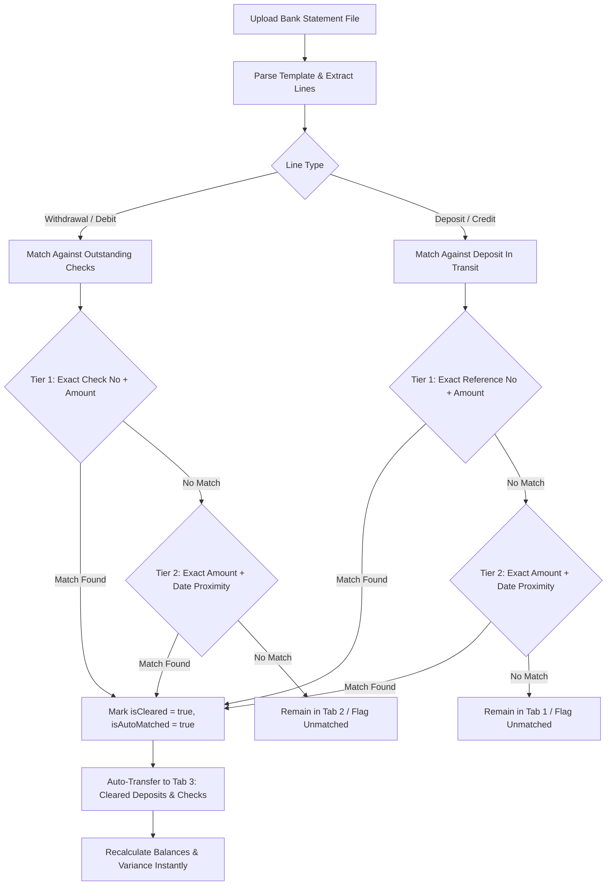

# Bank Reconciliation Module Architecture & Implementation Specification

> **Module**: Bank Reconciliation (`BR`)  
> **Domain**: Cash Receipt (`cash-receipt`)  
> **Route Base**: `/cash-receipt/bank-reconciliation`  
> **Standards Compliance**: [`FRONTEND_MAP.md`](file:///d:/FILES/PROGRAMS/Gr8BooksNeo/gr8bookslite-frontend/FRONTEND_MAP.md), [`QA_ANALYSIS_GUIDE.md`](file:///d:/FILES/PROGRAMS/Gr8BooksNeo/gr8bookslite-frontend/QA_ANALYSIS_GUIDE.md), and [`AGENTS.md`](file:///d:/FILES/PROGRAMS/Gr8BooksNeo/gr8bookslite-frontend/AGENTS.md)

---

## 1. Executive Summary & Smart Bank Recon Overview

The **Bank Reconciliation** module features a **Smart Bank Recon Engine** designed to automate the matching and clearing process. By uploading electronic bank statements (`.xls`, `.xlsx`, `.xlsm`), the system automatically identifies, matches, and clears corresponding records from **Deposit in Transit** and **Outstanding Checks**, transferring them directly to **Cleared Deposits & Outstanding Checks** while providing visual match indicators and real-time balance recalculation.

```
+-------------------------------------------------------------------------------------------------------------------------+
| [Section 1] Bank Reconciliation Information & Balances                                                                  |
|   [Column 1: Bank & Remarks]         [Column 2: Balances & Variances]           [Column 3: Document Details]            |
|   Bank: * [ AppAdvancedDropdown ]    Bank Balance:             [ 0.00 ]         BR No:                  [ 000001 ]      |
|   Account Code:  [ 11101300 ]        Adjustment Bank Balance:  [ 0.00 ]         BR Date:                [ 08/18/2026 ]  |
|   Account Title: [ Cash in Bank... ] Book Balance:             [ 0.00 ]         Status:                 [ Open ]        |
|   Remarks:       [ Textarea... ]     Adjustment Book Balance:  [ 0.00 ]                                                 |
|                                      Outstanding Check:        [ 0.00 ]                                                 |
|                                      Deposit in Transit:       [ 0.00 ]                                                 |
|                                      Variance:                 [ 0.00 ]                                                 |
+-------------------------------------------------------------------------------------------------------------------------+
| [Section 2] Upload Bank Statement (Smart Bank Recon Trigger)                                                            |
|   Bank Template: [ BDO Parser v ]            Bank Statement: [ statement_aug2026.xlsx ] [Browse] [Upload (Auto-Match)]  |
+-------------------------------------------------------------------------------------------------------------------------+
| [Section 3] Reconcile Checking                                                                                          |
|   [Tab 1: Deposit in Transit (3)] [Tab 2: Outstanding Checks (5)] [Tab 3: Cleared Deposits & Outstanding Checks (18)]   |
|   -------------------------------------------------------------------------------------------------------------------   |
|   [Clear] / [Unclear]                                                    [ Search VCEName/TransNo/Amount ] [Search]     |
|   +----+------------+---------------+---------+---------+---------+--------------------+------------+--------------+    |
|   | [] | AppDate    | VCEName       | RefType | TransNo | CheckNo | Remarks            | Amount     | Transacted   |    |
|   +----+------------+---------------+---------+---------+---------+--------------------+------------+--------------+    |
|   | [Badge: Automatically Matched Records (18 cleared)]                                                                 |
+-------------------------------------------------------------------------------------------------------------------------+
```

---

## 2. Smart Bank Recon Engine: Matching & Auto-Clearing Rules

When a statement file is uploaded:
1. The file is parsed based on the selected **Bank Template** into structured statement lines containing:
   - `statementDate`, `checkNumber`, `referenceNo`, `description`, `debitAmount` (withdrawals), `creditAmount` (deposits), `runningBalance`.
2. The **Smart Matching Pipeline** executes multi-tier heuristic matching against active ledger entries:



### Auto-Clearing Matching Tiers:
| Target Ledger | Match Tier | Criteria | Confidence | Action |
| :--- | :---: | :--- | :---: | :--- |
| **Outstanding Checks** | **Tier 1** | Exact `checkNo` == `statement.checkNo` AND `amount` == `statement.debit` | **100%** | Automatically clears check to Tab 3 |
| **Outstanding Checks** | **Tier 2** | Exact `amount` == `statement.debit` AND Date within $\pm 3\text{ days}$ | **90%** | Automatically clears check to Tab 3 |
| **Deposit in Transit** | **Tier 1** | Exact `transNo`/`refNo` == `statement.refNo` AND `amount` == `statement.credit` | **100%** | Automatically clears deposit to Tab 3 |
| **Deposit in Transit** | **Tier 2** | Exact `amount` == `statement.credit` AND Date within $\pm 2\text{ days}$ | **90%** | Automatically clears deposit to Tab 3 |

---

## 3. Comprehensive Field & Section Specifications

### Section 1: Bank Reconciliation Details
| Field Label | Property Name | Type | Component | Required | Behavior / Notes |
| :--- | :--- | :--- | :--- | :---: | :--- |
| **BR No:** | `brNo` / `transactionNo` | `string` | Readonly `TextField` | Yes | System auto-generated sequence (e.g., `000001`). |
| **Status:** | `status` | `string` | Readonly `TextField` / Badge | Yes | Status workflow: `Open` / `Draft`, `For Approval`, `Posted`, `Cancelled`. |

---

### Section 2: Select Bank
| Field Label | Property Name | Type | Component | Required | Behavior / Notes |
| :--- | :--- | :--- | :--- | :---: | :--- |
| **Bank: \*** | `bankId` / `bankName` | `string` | [`AppAdvancedDropdown`](file:///d:/FILES/PROGRAMS/Gr8BooksNeo/gr8bookslite-frontend/app/src/ui/shared/advanced-dropdown/AppAdvancedDropdown.tsx) + `Refresh` Button | **Yes** | Searchable bank master selection sourcing active banks from `bank-masterfile`. Automatically populates `accountCode`, `accountTitle`, and triggers unreconciled check and deposit retrieval. |
| **Account Code:** | `accountCode` | `string` | Readonly `TextField` | Yes | General ledger account code (e.g., `11101300`). |
| **Account Title:** | `accountTitle` | `string` | Readonly `TextField` | Yes | General ledger account title (e.g., `Cash In Bank - BDO 00-115000-2717`). |

---

### Section 3: Enter the Following From Your Statement (3-Column Worksheet)

#### Column 1: Book Balance
| Field Label | Property Name | Type | Component | Behavior / Notes |
| :--- | :--- | :--- | :--- | :--- |
| **Book Balance:** | `bookBalance` | `number` | Numeric Currency Input | Company general ledger balance as of the cutoff date. |
| **Adjusted Book Balance:** | `adjustedBookBalance` | `number` | Readonly Numeric Display | Computed value: $\text{Book Balance} + \text{Bank Credits} - \text{Bank Debits} + \text{Book Adjustments}$. |

#### Column 2: Bank Statement & In-Transit Adjustments
| Field Label | Property Name | Type | Component | Behavior / Notes |
| :--- | :--- | :--- | :--- | :--- |
| **Bank Balance:** | `bankBalance` | `number` | Numeric Currency Input | Ending balance from the bank statement (can be auto-filled by Smart Upload). |
| **Outstanding Check:** | `outstandingCheck` | `number` | Readonly Numeric Display | Automatically computed sum of all remaining uncleared items in **Tab 2 (Outstanding Checks)**. Decreases automatically upon Smart Upload. |
| **Deposit in Transit:** | `depositInTransit` | `number` | Readonly Numeric Display | Automatically computed sum of all remaining uncleared items in **Tab 1 (Deposit in Transit)**. Decreases automatically upon Smart Upload. |
| **Adjusted Bank Balance:** | `adjustedBankBalance` | `number` | Readonly Numeric Display | Computed formula: $\text{Bank Balance} - \text{Outstanding Check} + \text{Deposit in Transit}$. |

#### Column 3: Period Target & Variance
| Field Label | Property Name | Type | Component | Behavior / Notes |
| :--- | :--- | :--- | :--- | :--- |
| **BR Date:** | `endingDate` | `string` | Date Picker (`type="date"`) | Cutoff reconciliation date (e.g., `08/18/2026`). |
| **Variance:** | `variance` | `number` | Readonly Status Display | Computed formula: $\text{Adjusted Bank Balance} - \text{Adjusted Book Balance}$. Automatically approaches `0.00` as Smart Recon clears records. Displayed in green when balanced (`0.00`), coral/red when non-zero. |

---

### Section 4: Upload Bank Statement (Smart Recon Trigger)
| Field Label | Property Name | Type | Component | Behavior / Notes |
| :--- | :--- | :--- | :--- | :--- |
| **Bank Template:** | `bankTemplate` | `string` | Select Dropdown | Bank-specific column mappings (e.g., `BDO Statement`, `BPI Statement`, `Metrobank Statement`, `UnionBank Statement`, `Security Bank Statement`, `Standard CSV/Excel`). |
| **Bank Statement:** | `statementFile` | `File` / `string` | File Upload with `Browse` & `Upload` buttons | Accepts `.xls, .xlsx, .xlsm`. Triggers the **Smart Matching Pipeline**, auto-clears transactions, and displays match summary. |

---

## 4. Section 5: Reconcile Checking (3-Tab Specification)

```tsx
<div role="tablist" className="flex border-b border-darknavy/10">
  <button role="tab" aria-selected={activeTab === "deposit-in-transit"}>Deposit in Transit ({ditCount})</button>
  <button role="tab" aria-selected={activeTab === "outstanding-checks"}>Outstanding Checks ({ocCount})</button>
  <button role="tab" aria-selected={activeTab === "cleared"}>Cleared Deposits & Outstanding Checks ({clearedCount})</button>
</div>
```

---

### Tab 1: Deposit in Transit (`deposit-in-transit`)
Holds all uncleared deposit receipts.
- **Top Action Button**: `Clear` (Manual clear for selected rows).
- **Top Search**: `Search VCEName/TransNo/Amount` + `Search` button.
- **Table Columns**:
  1. `[ ]` (Multi-select checkbox)
  2. `AppDate` (Application / Deposit Date)
  3. `VCEName` (Customer / Entity Name)
  4. `RefType` (Reference Type, e.g. `CR`, `OR`, `AR`)
  5. `TransNo` (Transaction Number)
  6. `Remarks` (Particulars / Description)
  7. `Amount` (Deposit Amount)
  8. `Transacted` (Status indicator)

---

### Tab 2: Outstanding Checks (`outstanding-checks`)
Holds all uncleared disbursement checks.
- **Top Action Button**: `Clear` (Manual clear for selected checks).
- **Top Search**: `Search VCEName/TransNo/Amount` + `Search` button.
- **Table Columns**:
  1. `[ ]` (Multi-select checkbox)
  2. `AppDate` (Check Issue Date)
  3. `VCEName` (Payee / Vendor Name)
  4. `RefType` (Reference Type, e.g. `CV`, `APV`, `DV`)
  5. `TransNo` (Transaction Number)
  6. `CheckNo` (Bank Check Number)
  7. `Remarks` (Particulars / Description)
  8. `Amount` (Disbursement Amount)
  9. `Transacted` (Status indicator)
- **Footer**: `Automatically Matched Records` badge.

---

### Tab 3: Cleared Deposits & Outstanding Checks (`cleared`)
Holds all cleared transactions (both Smart Auto-Cleared and Manually Cleared).
- **Top Action Button**: `Unclear` (Restores selected rows back to Tab 1 or Tab 2 and re-adds to outstanding totals).
- **Top Search**: `Search VCEName/TransNo/Amount` + `Search` button.
- **Table Columns**:
  1. `[ ]` (Multi-select checkbox)
  2. `AppDate` (Transaction Date)
  3. `VCEName` (Entity Name)
  4. `RefType` (Reference Type)
  5. `TransNo` (Transaction Number)
  6. `CheckNo` (Check Number or `-`)
  7. `Remarks` (Remarks)
  8. `Amount` (Cleared Amount)
  9. `Transacted` (Clearance status indicator)
- **Footer**: List of `Automatically Matched Records` with match badge and timestamp.

---

## 5. Mathematical Balancing Formulas

$$\text{Deposit In Transit} = \sum_{i \in \text{Tab 1}} \text{Amount}_i$$

$$\text{Outstanding Checks} = \sum_{j \in \text{Tab 2}} \text{Amount}_j$$

$$\text{Adjusted Bank Balance} = \text{Bank Balance} - \text{Outstanding Checks} + \text{Deposit In Transit}$$

$$\text{Adjusted Book Balance} = \text{Book Balance} + \text{Bank Credits} - \text{Bank Debits} + \text{Book Adjustments}$$

$$\text{Variance} = \text{Adjusted Bank Balance} - \text{Adjusted Book Balance}$$

$$\text{Zero Variance Guaranteed} \iff \text{Variance} = 0.00$$

---

## 6. Directory Structure (Canonical 7-Layer Architecture)

```
gr8bookslite-frontend/
├── app/
│   ├── (modules)/
│   │   └── cash-receipt/
│   │       └── bank-reconciliation/
│   │           ├── page.tsx                           # Root route -> renders <BankReconciliationListPage />
│   │           ├── add/
│   │           │   └── page.tsx                       # Add route -> renders <BankReconciliationFormPage />
│   │           ├── edit/
│   │           │   └── [recordId]/
│   │           │       └── page.tsx                   # Edit route -> renders <BankReconciliationFormPage />
│   │           └── view/
│   │               └── [recordId]/
│   │                   └── page.tsx                   # View route -> renders <BankReconciliationFormPage />
│   └── src/
│       ├── constants/modules/cash-receipt/bank-reconciliation/
│       │   └── BankReconciliationConstants.ts         # Tab keys, table columns, template options, copy
│       ├── types/modules/cash-receipt/bank-reconciliation/
│       │   └── BankReconciliationTypes.ts             # Domain models, checking items, match results
│       ├── validations/modules/cash-receipt/bank-reconciliation/
│       │   └── BankReconciliationValidation.ts        # Zod validation schema
│       ├── data/modules/cash-receipt/bank-reconciliation/
│       │   └── BankReconciliationData.ts              # Balance computation & Smart Matching heuristics
│       ├── services/modules/cash-receipt/bank-reconciliation/
│       │   ├── BankReconciliationApi.ts               # Statement file parser & reconciliation CRUD
│       │   └── BankReconciliationQueryKeys.ts         # Query keys scoped to ["cash-receipt", "bank-reconciliation"]
│       ├── hooks/modules/cash-receipt/bank-reconciliation/
│       │   ├── useBankReconciliation.ts               # CRUD state hooks
│       │   ├── useBankReconciliationListPage.ts       # Table filters, pagination, metrics
│       │   └── useBankReconciliationFormPage.ts       # Form state, Smart Match trigger, clear/unclear handlers
│       └── ui/modules/cash-receipt/bank-reconciliation/
│           ├── BankReconciliationListPage.tsx         # List page view
│           ├── BankReconciliationTableRow.tsx         # List row rendering
│           ├── BankReconciliationRecordActions.tsx    # List action menu (View, Edit, Approve, Cancel)
│           ├── BankReconciliationStatisticCards.tsx   # Top KPI metrics cards
│           ├── BankReconciliationFormPage.tsx         # Form page orchestrator (Sections 1-4 + Tabs)
│           ├── BankReconciliationCheckingSection.tsx  # 3-Tab Reconcile Checking workspace
│           ├── BankReconciliationCheckingTable.tsx    # Checking data table with search, checkboxes, clear/unclear
│           └── BankReconciliationNotFound.tsx         # 404 state
```

---

## 7. Quality Assurance Checklist

- [x] **Smart Bank Recon Ready**: Full specification for statement parsing, automated clearing, and moving records to Tab 3.
- [x] **No Anti-Patterns**: Zero legacy `Main.tsx`, `Action.tsx`, or `index.ts` files.
- [x] **Direct Route Imports**: Route files directly import `BankReconciliationListPage` and `BankReconciliationFormPage`.
- [x] **Bank Master Advanced Dropdown**: Integrated with `bank-masterfile` via [`AppAdvancedDropdown`](file:///d:/FILES/PROGRAMS/Gr8BooksNeo/gr8bookslite-frontend/app/src/ui/shared/advanced-dropdown/AppAdvancedDropdown.tsx) and live `Refresh` button.
- [x] **Exact 3-Tab Checking Layout**:
  - `Deposit in Transit` with `Clear` action and search.
  - `Outstanding Checks` with `Clear` action, `CheckNo` column, and search.
  - `Cleared Deposits & Outstanding Checks` with `Unclear` action and search.
- [x] **Dynamic Reactive Balancing**: Recalculates `Outstanding Check`, `Deposit in Transit`, `Adjusted Bank Balance`, and `Variance` in real time as items are cleared.
