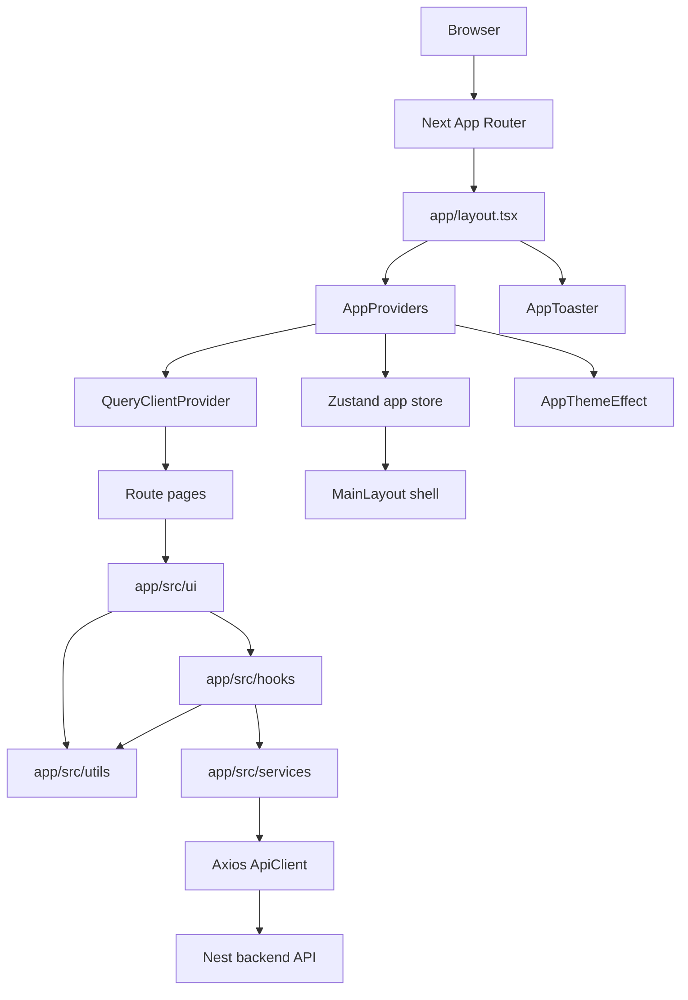
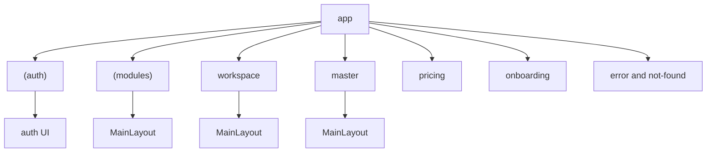
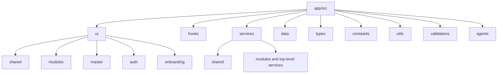
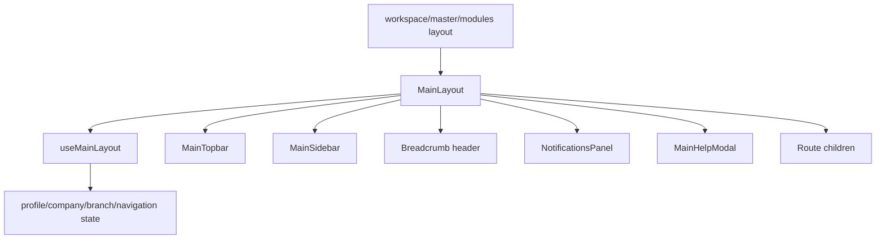
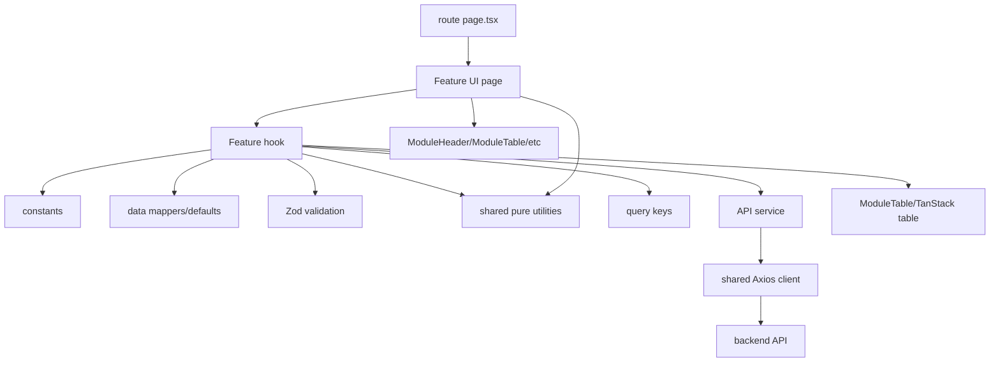

# Gr8Books Neo Frontend Map

Last updated: 2026-07-22

Use this file as the first stop before changing the frontend. It is a compact graph of how the app is organized, where code belongs, and which files usually matter for common changes.

## Quick Facts

- Framework: Next.js App Router, React, TypeScript.
- Main app directory: `app/`.
- Shared source directory: `app/src/`.
- Import alias: `@/*` maps to the repo root.
- Local dev server: `npm run dev`, served on `http://localhost:3001`.
- Backend API base URL: `NEXT_PUBLIC_API_BASE_URL`, usually `http://localhost:3000/api/v1`.
- Main frontend libraries: TanStack Query, Zustand, Axios, Zod, Tailwind CSS, lucide-react, Recharts, pdfmake.
- Route navigation cache: `next.config.ts` enables `experimental.staleTimes` with 30 seconds for dynamic segments and 5 minutes for static/prefetched segments.

## Runtime Graph



## Route Areas



- `app/(auth)`: login, signup, forgot password, verification, auth legal pages.
- `app/(modules)`: tenant/company modules such as financial maintenance, item management, party management, warehouse management, delivery vehicle management, inventory, sales, purchasing, system administration, cash receipt, and cash disbursement.
- `app/workspace`: company/workspace administration pages.
- `app/master`: platform administration pages.
- `app/onboarding`: onboarding flow, guarded by `proxy.ts`.
- `app/pricing`: public pricing page.

Route files should stay thin. They should import and render UI from `app/src/ui/...`.

### Maintenance Domain Roots

Maintenance features are grouped by their business module instead of a generic `maintenance` source or route folder:

```txt
app/(modules)/
  financial-maintenance/
  item-management/
  party-management/
  warehouse-management/
  delivery-vehicle-management/

app/src/{ui,hooks,services,data,types,constants,validations}/modules/
  financial-maintenance/
  item-management/
  party-management/
  warehouse-management/
  delivery-vehicle-management/
```

Party Management, Warehouse Management, and Delivery Vehicle Management are independent module roots. Warehouse storage, inventory, and operation features live directly under `warehouse-management`; delivery vehicle operation features live directly under `delivery-vehicle-management`. New feature paths must use the same business-module root across routes and every source concern.

Financial Maintenance includes `services-maintenance` at `/financial-maintenance/services-maintenance`; it follows the drawer/list maintenance pattern and appears after Bank Masterfile in catalogs/navigation.

Legacy browser paths under `/maintenance/...` redirect temporarily to the corresponding business-module route. Backend API endpoints containing `/maintenance/` are unchanged.

## Source Directory Graph



### What Belongs Where

- `app/src/ui/...`: React components only.
- `app/src/hooks/...`: client state, orchestration, routing, table state, submit handlers.
- `app/src/services/...`: API wrappers, server actions, TanStack query keys, external integrations.
- `app/src/data/...`: mock/static records, defaults, local storage helpers, pure mappers.
- `app/src/types/...`: TypeScript-only types.
- `app/src/constants/...`: hrefs, options, table column config, storage keys, labels.
- `app/src/utils/...`: generic, pure formatting and normalization helpers shared
  across unrelated modules.
- `app/src/validations/...`: Zod schemas and validation helpers.

### Shared Utilities

```txt
app/src/utils/
  currency.util.ts  # formatCurrency(value, currencyCode = "PHP")
  date.util.ts      # formatDateTime(value, options)
  file.util.ts      # formatFileSize(bytes)
  status.util.ts # shared Active/Inactive switch options
  string.util.ts    # lowercase-text and whitespace normalization
```

Utilities are framework-independent and side-effect-free. They receive their
inputs through parameters and must not own React state, API access, browser
storage, feature business rules, or validation rules.

Use `app/src/utils` when the same generic behavior is needed by unrelated
features. Keep feature-only helpers with the feature until they become genuinely
shared. Keep pure feature mappers in `data`, external operations in `services`,
stateful behavior in `hooks`, and Zod or application validation in
`validations`.

## Shared Runtime Files

- `app/layout.tsx`: root HTML/body, app metadata, providers, toaster.
- `app/src/ui/shared/app/AppProviders.tsx`: mounts TanStack Query provider, loads session token into Zustand, applies theme.
- `app/src/services/shared/app/QueryClient.ts`: shared TanStack Query defaults.
- `app/src/services/shared/api/ApiClient.ts`: Axios client and error normalization.
- `app/src/services/shared/api/ApiUrl.ts`: reads and normalizes `NEXT_PUBLIC_API_BASE_URL`.
- `app/src/hooks/shared/app/useAppStore.ts`: global Zustand state for access token, active company, auth readiness, sidebar open state.
- `proxy.ts`: guards `/onboarding/:path*` using the `gr8booksneo.accessToken` cookie.

## Main Shell



Main shell entry points:

- `app/workspace/layout.tsx`
- `app/master/layout.tsx`
- `app/(modules)/layout.tsx`
- `app/src/ui/shared/main-layout/MainLayout.tsx`
- `app/src/hooks/shared/main-layout/useMainLayout.ts`
- `app/src/ui/shared/main-layout/main-topbar/*`
- `app/src/ui/shared/main-layout/sidebar/*`
- `app/src/ui/shared/main-layout/notifications-panel/*`

## Feature Module Pattern

Recommended module shape:

```txt
app/(modules)/<domain>/<feature>/
  page.tsx
  add/page.tsx
  edit/[recordId]/page.tsx
  view/[recordId]/page.tsx

app/src/ui/modules/<domain>/<feature>/
  FeatureListPage.tsx
  FeatureFormPage.tsx
  FeatureTable.tsx
  FeatureTableRow.tsx
  FeatureRecordActions.tsx
  FeatureDetailsPanel.tsx
  FeatureNotFound.tsx

app/src/hooks/modules/<domain>/<feature>/
app/src/services/modules/<domain>/<feature>/
app/src/data/modules/<domain>/<feature>/
app/src/types/modules/<domain>/<feature>/
app/src/constants/modules/<domain>/<feature>/
app/src/validations/modules/<domain>/<feature>/
```

For new work, prefer specific names such as `PurchaseRequestListPage.tsx` and `PurchaseRequestFormPage.tsx`. Older modules may still use generic `Main.tsx`, `Action.tsx`, or `index.ts`; avoid extending that pattern for new modules.

## Data Flow For A Module Page



## Shared UI To Reuse

- Module list chrome: `app/src/ui/shared/module/ModuleHeader.tsx`.
- Table shell: `app/src/ui/shared/module/module-table/ModuleTable.tsx`.
- Table pieces: `ModuleTableHeader.tsx`, `ModuleTableBody.tsx`, `ModuleTablePagination.tsx`, `utils.ts`.
- Module utilities: `ModuleTableToolbar.tsx`, `ModuleTableActions.tsx`, `ModuleStatisticCards.tsx`, `ModuleDrawer.tsx`, `ModuleNotFound.tsx`.
- App shell primitives: `app/src/ui/shared/app/*`.
- Dialogs and reusable inputs: `app/src/ui/shared/transaction-setup/*`, `advanced-dropdown`, `tag-input`, `media`, `tour`.

## Common Change Paths

- Add a route: create a thin `page.tsx` under `app/...`, then put real UI in `app/src/ui/...`.
- Add a CRUD module: create routes plus matching `ui`, `hooks`, `data`, `types`, `constants`, `validations`, and `services` folders as needed.
- Add API access: use `ApiClient` from `app/src/services/shared/api/ApiClient.ts`; keep query keys in a service file near the feature.
- Add form validation: put Zod schema and helper functions under `app/src/validations/...`.
- Add shared formatting or normalization: put a focused, pure helper under
  `app/src/utils/*.util.ts`; do not create a catch-all `helpers.ts`.
- Add table behavior: build table state/columns in hooks/constants and render with shared `ModuleTable`.
- Change shell navigation: start with `useMainLayout.ts`, sidebar files, and topbar files.
- Change auth/session behavior: check `app/src/services/auth/*`, `app/src/data/auth/*`, `AppProviders.tsx`, and `useAppStore.ts`.
- Change onboarding access: check `proxy.ts` and onboarding service/hook/UI files.

## Checks

Run near the end of frontend changes:

```bash
npm run lint
npm run build
```

For route refactors, also search for old route shapes:

```bash
rg '/add/new|add/\[recordId\]|add\\\[recordId\\\]' 'app/(modules)' app/src -g '*.tsx' -g '*.ts'
```

## Notes For Future Agents

- Read `AGENTS.md` before structural frontend changes; it is the source of detailed repo rules.
- Use Tailwind tokens from `app/globals.css`, especially `darknavy`, `coralpink`, `citron`, `offwhite`, and `skyblue`.
- Avoid putting hooks, constants, data, types, or validation in `app/src/ui/...`.
- Prefer the existing modular monolith shape over introducing a new architecture.
