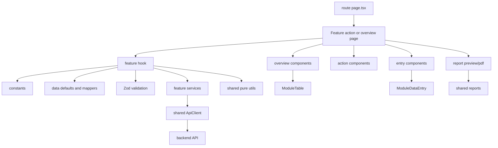
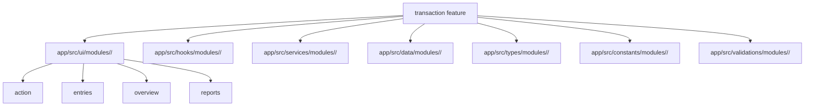

# Gr8Books Neo Frontend Transaction Map

Last updated: 2026-08-13

Use this file as the first stop before changing transactional frontend modules.
It repeats the useful structure from `FRONTEND_MAP.md`, but narrows the guidance
to transaction features that have overview lists, add/edit/view action pages,
entry grids, file attachments, and report previews.

This structure is strictly for transactional modules only, such as sales,
purchasing, inventory, cash receipt, cash disbursement, accounts payable, and
general journal transactions. Do not use this structure for maintenance modules
or system administration modules. Some existing transaction folders still use
older names such as `form/`, `<ModuleName>ListPage.tsx`, or feature files
directly under the feature root. Do not copy those older layouts for new
transactional work unless you are only making a small local fix inside an
existing transaction feature, or unless the task explicitly asks to format that
existing transaction feature using this structure.

## Quick Facts

- Framework: Next.js App Router, React, TypeScript.
- Transaction routes live under `app/(modules)/<domain>/<feature>/`.
- Transaction UI lives under `app/src/ui/modules/<domain>/<feature>/`.
- Non-UI transaction code lives in matching `app/src/{hooks,services,data,types,constants,validations}/modules/<domain>/<feature>/` folders.
- Import alias: `@/*` maps to the repo root.
- Shared entry grid UI: `ModuleDataEntry`.
- Shared report UI: `app/src/ui/shared/reports`.
- Validation belongs in Zod files under `app/src/validations/...`.
- API calls use the shared `ApiClient`.
- Shared utilities must come from `app/src/utils/`.
- Shared date filters must use `DateRangePicker` from
  `app/src/ui/shared/date-range-picker/DateRangePicker.tsx`.
- Shared amount filters must use `AmountRangePicker` from
  `app/src/ui/shared/amount-range-picker/AmountRangePicker.tsx`.
- Feature-specific entry row utilities stay in `entries/utils/`.
- Check [FRONTEND_UTILITY.md](FRONTEND_UTILITY.md) before adding or duplicating
  a helper.

## Transaction Runtime Graph



## Top Actions And Quick Tour

Do not duplicate global top-bar actions inside a transaction list header. If
the main app header already provides Quick Tour, Import, Export, or similar
module-level actions, the transaction overview header should not add a second
copy of those buttons.

For Quick Tour support, expose stable spotlight targets instead of adding a
local Quick Tour button. Use these default ids on list pages:

```txt
data-spotlight-id="maintenance-create-record"  # primary add/start action
data-spotlight-id="maintenance-table-filters"  # search and filters toolbar
data-spotlight-id="maintenance-table-options"  # column visibility and refresh
data-spotlight-id="maintenance-table"          # table wrapper
```

## Route Areas

Transactional features are usually inside these module domains:

- `app/(modules)/sales/<feature>/`
- `app/(modules)/purchasing/<feature>/`
- `app/(modules)/inventory/<feature>/`
- `app/(modules)/cash-receipt/<feature>/`
- `app/(modules)/cash-disbursement/<feature>/`
- `app/(modules)/accounts-payable/<feature>/`
- `app/(modules)/general-journal/<feature>/`

Route files stay thin. They should import and render UI from `app/src/ui/...`.

```txt
app/(modules)/<domain>/<feature>/
  page.tsx
  add/page.tsx
  edit/[recordId]/page.tsx
  view/[recordId]/page.tsx
```

Use `page.tsx` for the overview list. Use `add`, `edit/[recordId]`, and
`view/[recordId]` for the shared transaction action screen. Never use
`/add/new`.

## Source Directory Graph



### What Belongs Where

- `app/src/ui/...`: React components only.
- `app/src/hooks/...`: form state, route mode, table state, entry row state,
  submit orchestration, upload orchestration, and navigation handlers.
- `app/src/services/...`: API wrappers, query keys, server actions, upload and
  download calls, and external operations.
- `app/src/data/...`: initial values, mock/static records, row defaults, and
  pure record/form mappers.
- `app/src/types/...`: TypeScript-only record, form, entry, status, mode,
  attachment, filter, and error types.
- `app/src/constants/...`: hrefs, labels, status options, table columns,
  pagination keys, entry tabs, visible-column options, and static select
  options.
- `app/src/validations/...`: Zod schemas, cross-field validation, required-row
  checks, duplicate checks, debit/credit balance checks, and error mapping.
- `app/src/utils/...`: generic, pure formatting and normalization helpers shared
  across unrelated modules.

Route href constants must come from the module catalog. Import
`getModuleRoute` from `app/src/data/shared/modules/ModuleCatalogData.ts`, then
export the feature href from the matching module code instead of duplicating the
route string:

```ts
import { getModuleRoute } from "@/app/src/data/shared/modules/ModuleCatalogData";

export const <ModuleName>Href = getModuleRoute("<ModuleCode>");
```

Do not put hooks, API calls, application state, validation rules, constants,
types, or data mappers inside transaction UI folders. Feature-specific entry
row UI helpers may live in `entries/utils/`. When utility logic is shared or
reusable across modules, import an existing helper from `app/src/utils/` before
adding a new one. See [FRONTEND_UTILITY.md](FRONTEND_UTILITY.md) for the
current utility list.

## Current Transaction Feature Pattern

Follow this structure strictly for transactional modules. Create only the files
the transaction actually uses, but do not add alternative folders or rename the
standard folders. The only allowed UI expansion is inside `action/`: if the
transaction form has multiple tabs, create one separate ActionPage tab file per
tab.

```txt
app/src/ui/modules/<domain>/<feature>/
  action/
    <ModuleName>ActionPage.tsx
    <ModuleName>ActionHeader.tsx
    <ModuleName>ActionHistory.tsx
    <ModuleName>DetailsFields.tsx
    <ModuleName>FieldControls.tsx
    <ModuleName>FileAttachmentFields.tsx
    <ModuleName>NotFound.tsx
    # Only when the form has multiple tabs:
    <ModuleName><TabName>Tab.tsx
  entries/
    utils/
      <ModuleName>EntryRowUtils.ts
    <ModuleName>EntryCellControls.tsx
    <ModuleName>EntrySection.tsx
    <ModuleName>EntryTabs.tsx
    <ModuleName>LineColumns.tsx
  overview/
    <ModuleName>OverviewPage.tsx
    <ModuleName>RecordActions.tsx
  reports/
    <ModuleName>Pdf.ts
    <ModuleName>ReportPreview.tsx
```

```txt
app/src/hooks/modules/<domain>/<feature>/
  use<ModuleName>ActionPage.ts
  use<ModuleName>OverviewPage.ts

app/src/data/modules/<domain>/<feature>/
  <ModuleName>Data.ts

app/src/types/modules/<domain>/<feature>/
  <ModuleName>Types.ts

app/src/constants/modules/<domain>/<feature>/
  <ModuleName>Constants.ts

app/src/validations/modules/<domain>/<feature>/
  <ModuleName>Validation.ts

app/src/services/modules/<domain>/<feature>/
  <ModuleName>Service.ts
```

`<domain>` is the business module route segment. `<feature>` is the
transaction feature route segment. `<ModuleName>` is the PascalCase feature
name used in files and exported symbols.

Use the module display name in UI labels with each word capitalized. For
example, `<ModuleName>` in code becomes a readable label such as
`Cash Advance Multiple Entry` in headings, buttons, filters, empty states, and
table labels.

For transaction UI and frontend source code, use Party terminology. Do not show
VCE-facing labels, placeholders, column names, validation messages, filters, or
helper text. New or refactored transaction frontend types, form fields,
constants, hooks, validation keys, table columns, and component props must use
`partyCode` and `partyName`, not `vceCode` or `vceName`. Use `vceCode` or
`vceName` only inside narrow legacy/API adapter mapping code when the backend
contract still requires those names.

## Route Files

Overview route:

```tsx
import { <ModuleName>OverviewPage } from "@/app/src/ui/modules/<domain>/<feature>/overview/<ModuleName>OverviewPage";

export default function Page() {
  return <<ModuleName>OverviewPage />;
}
```

Action routes:

```tsx
import { <ModuleName>ActionPage } from "@/app/src/ui/modules/<domain>/<feature>/action/<ModuleName>ActionPage";

export default function Page() {
  return <<ModuleName>ActionPage />;
}
```

Use the same `ActionPage` import for `add/page.tsx`,
`edit/[recordId]/page.tsx`, and `view/[recordId]/page.tsx`. The hook should
derive add, edit, or view mode from the current route.

## Action Folder

`<ModuleName>ActionPage.tsx`

- Top-level add/edit/view transaction screen.
- Calls `use<ModuleName>ActionPage`.
- Composes `<ModuleName>ActionHeader`, tabs, detail fields, entries,
  attachments, report preview, and drawers.
- Does not define validation rules, API calls, row defaults, or large mappers.
- Does not define header button groups, action title helpers, action
  description helpers, or status action controls; put those in
  `<ModuleName>ActionHeader.tsx`.
- When the form has multiple tabs, composes tab files from the same `action/`
  folder instead of placing all tab content in `ActionPage`.
- Starts new unsaved transactions with the placeholder status `Open`.
- Uses `action/<ModuleName>NotFound.tsx` for missing records in edit/view mode.

`<ModuleName>NotFound.tsx`

- Transaction-specific missing-record state for edit/view action routes.
- Prefer shared `ModuleNotFound` when custom behavior is not needed.
- Keep this component in `action/`, because it belongs to action routes and not
  the overview table.

`<ModuleName>ActionHeader.tsx`

- Transaction mode, document number, status, and primary actions.
- Can include save, post, approve, void, print, preview, duplicate, and back
  controls.
- Use icon buttons with `ModuleTooltip` when labels are hidden.
- Follows the default mode button sets and button tones described below.
- Owns action header title/description helpers, action button rendering, and
  header-only icon imports. Keep `ActionPage` free from these header details.

`<ModuleName>ActionHistory.tsx`

- Owns the action-page History button, its open/close state, and the mapping of
  the current transaction record into history entries.
- Uses the shared `ModuleHistoryDialog`; do not recreate transaction history
  dialog chrome inside the feature.
- Keep this file module-specific even when two transaction record shapes are
  similar. Each module should own its labels, event descriptions, identifiers,
  and record-to-history mapping instead of importing another feature's Action
  History component.
- Compose it from `<ModuleName>ActionHeader.tsx` for edit/view modes where a
  record exists. Do not embed history dialog state or history-entry builders in
  `ActionHeader`, `ActionPage`, or lifecycle `ViewActions` components.

`<ModuleName>DetailsFields.tsx`

- Header/detail fields such as party, warehouse, date, terms, reference,
  currency, project, branch, responsibility center, and remarks.
- Receives values, errors, readonly state, and field update callbacks.
- Uses real `<label>` elements and marks required fields with a red `*`, using
  the shared field shell's required marker instead of embedding `*` in label
  strings.
- Use the `[Label] [Input Field]` field layout in transaction detail forms:
  label on the left, input/control on the right, with validation text below the
  input/control.
- Keep all standard transaction controls in the same row height. Text inputs,
  selects, money inputs, date inputs, readonly code fields, status fields, and
  `AppAdvancedDropdown` controls should use the shared transaction field height
  so adjacent fields align visually.
- Use the three-column transaction detail format: Name, Code, Transaction.
  The first column contains name fields, the second column contains their
  matching code fields, and the third column contains transaction identity
  fields.
- Align name/code pairs by row. For example, `Party Name` aligns with
  `Party Code`, and `Account Title` aligns with `Account Code`.
- The Transaction column contains `[ModuleName] No.`, `[ModuleName] Date`, and
  `Status`. Do not label the number field with the module code or generic
  `Transaction No.` in the UI.
- Transaction number behavior depends on the module's transaction-number
  setup. When the module is configured for automatic numbering, generate the
  `[ModuleName] No.` value from the module prefix plus a six-digit padded
  sequence, such as `<MODULE_PREFIX>-000001`, and render the field readonly.
  When the module is configured for manual numbering, do not generate a default
  value and render the field editable so the user can enter the number.
- Display transaction dates in the readable date-only format, such as
  `Jan 22, 2026`. Use `formatDate` from `app/src/utils/date.util.ts` for
  date-only UI values. Use `formatDateTime` only when the UI intentionally
  needs time. Keep ISO values such as `2026-01-22` only for native date inputs,
  API payloads, and internal form values.
- For the `[ModuleName] No.` input placeholder, use title case. Use
  `Auto Generated [ModuleName] Transaction Number` for automatic numbering and
  `Enter [ModuleName] Transaction Number` for manual numbering.
- Render action-page Status as a readonly input/display field. Do not use a
  dropdown for Status in the transaction detail form; lifecycle changes belong
  in the header actions or approval controls.
- Readonly transaction inputs, including generated numbers, aligned code
  fields, calculated amounts, and status fields, must use the shared gray
  readonly field styling so they are visibly non-editable.
- Use `AppLimitedTextarea` from `app/src/ui/shared/app/AppLimitedTextarea.tsx`
  for Remarks. Keep the standard 500-character limit and visible counter. For
  transaction action page remarks, render it in one column only at the end of
  the first column, and allow both vertical and horizontal resize with the
  `resize` class while keeping it constrained to its column, unless a module
  has a documented layout exception.
- Money amount inputs should use `MoneyNumberField` from
  `app/src/ui/shared/money/MoneyNumberField.tsx`. Amount fields are
  right-aligned with tabular numbers, use money formatting, and display two
  decimal places by default, such as `.00`, after blur and for loaded values.

`<ModuleName>FieldControls.tsx`

- Small presentational controls reused by the action fields.
- Good for typed field updater types, select wrappers, date controls, amount
  inputs, and readonly display controls.
- Put reusable mapped field-name types here or in `<ModuleName>Types.ts`.
  For example, a string-only form field key type such as
  `<ModuleName>TextFieldName` should not be declared inside
  `<ModuleName>DetailsFields.tsx` when it is used by reusable field controls.
- Option lists belong in constants. API-backed lookup behavior belongs in hooks
  or services.
- Transaction lookup fields should use `AppAdvancedDropdown` from
  `app/src/ui/shared/advanced-dropdown/`. Use its `addAction` for inline Add
  behavior on these fields:

```txt
Party Name
Payment Type
Bank
Responsibility Center
Project Name
Expenses
Collection
Services
Discount
Terms
```

- Account lookup fields such as `Account Title` and `Default Account Title`
  should also use the shared advanced dropdown, but should not show an inline
  Add button unless the module has a documented chart-account creation flow.
- Add actions for maintenance-backed lookup fields listed above should open a
  right-side `ModuleDrawer` UI, not an inline form, centered dialog, or page
  navigation. Follow the maintenance drawer pattern: blurred/dimmed backdrop,
  right-side panel, eyebrow, title, description, close button, scrollable form
  body, and sticky footer actions such as `Cancel` and `Save [RecordName]`.
  Reuse the actual maintenance drawer component for the lookup:

```txt
Party Name -> PartyManagementDrawer
Payment Type -> PaymentTypeDrawer
Bank -> BankMasterfileDrawer
Responsibility Center -> ResponsibilityCenterDrawer
Project Name -> ResponsibilityCenterDrawer
Expenses -> DefaultAccountDrawer
Collection -> DefaultAccountDrawer
Services -> ServicesMaintenanceDrawer
Discount -> DiscountMaintenanceDrawer
Terms -> TermsMaintenanceDrawer
```

  Keep drawer open state in the transaction action page and pass an
  `onSaved`/create callback that selects the newly saved record back into the
  active transaction field and its aligned readonly code field before closing
  the drawer.
- Keep the `AppAdvancedDropdown` remove/clear button enabled by default. When a
  name lookup clears, also clear its aligned readonly code field so placeholders
  appear muted and do not look like entered values.

`<ModuleName>FileAttachmentFields.tsx`

- Upload, display, remove, and readonly attachment UI.
- Use the shared transaction attachment component:
  `app/src/ui/shared/transaction-setup/TransactionFileAttachmentFields.tsx`.
- Attachment state and upload orchestration belong in hooks or services.

## Action Page Defaults

### Transaction Number

Transaction number behavior must follow the module's transaction-number setup.
For automatic numbering, generate the transaction number from the module
transaction prefix and a six-digit padded sequence using the format
`<MODULE_PREFIX>-000001`; keep the field readonly in the action page once a
value is assigned, and let the backend or configured transaction-number service
own the final sequence assignment.

For manual numbering, do not generate a transaction number in defaults or form
initializers. Start with an empty value, keep the `[ModuleName] No.` field
editable in add/edit modes, and validate it as a required user-entered field.

### Status

Use `Open` as the beginning placeholder status for a brand-new unsaved
transaction. `Open` is not an official saved status. Do not display `Draft`
until the user saves the transaction as draft.

### Header Title

View and edit action pages should use this title format:

```txt
[Action] [ModuleName] | [[ModuleName] No.] [Status Badge]
```

Use the existing shared transaction status badge for `[Status Badge]`.

### Header Buttons

Add mode header buttons:

```txt
Back
Preview
Copy From
Save
Save As Draft
```

View mode header buttons:

```txt
Back
Preview
History
Approve
Disapprove
Cancel
Copy To       # show when already approved
Edit          # show when editable, such as not for approval or draft
```

Edit mode header buttons:

```txt
Back
Preview
Approve
Disapprove
Cancel
Save
```

Use the shared save control for transaction action headers:

```tsx
import { ModuleSaveButton } from "@/app/src/ui/shared/module/ModuleSaveButton";
```

Render the primary Save action with `<ModuleSaveButton />`. When a transaction
needs Save As Draft or other save options, pass them through `menuItems` instead
of creating separate custom save buttons.

Regular Save must run the module's full validation before persisting. Save As
Draft is intentionally more permissive: it should persist the user's current
incomplete data without running full required-field, line-completeness,
duplicate, or balancing validation. Use only lightweight draft-safe checks when
needed to protect storage or routing, such as a valid generated transaction
number in automatic-numbering modules.

When Saving, Updating, Approving, Disapproving, or Cancelling a transaction or a
maintenance drawer record, use the shared confirmation/pending action pattern.
Show a confirmation dialog before the state-changing action, disable duplicate
submits while pending, and use a clear pending label such as `Saving...`,
`Updating...`, `Approving...`, `Disapproving...`, or `Cancelling...`. For
maintenance drawers, use the `ModuleDrawer` managed footer/save flow when
possible, including `getModuleSavePendingLabel(mode)` for add/edit saves.

Use `app/src/ui/shared/app/AppDialog.tsx` for these transaction confirmations.
Every visible action button must invoke working behavior; do not leave lifecycle,
save, history, copy-from, or navigation actions wired to `() => undefined` or an
empty handler. Hide or disable unfinished actions. A visible deferred Preview
action is allowed only when the module request explicitly scopes Preview out for
the current implementation.

Use these default action-header button icons and color patterns:

```txt
Back         # ArrowLeft, neutral white button, dark text
Preview      # FileText, neutral white button, dark text
History      # History, neutral white button, dark text
Approve      # ThumbsUp, green/success outline, green text
Disapprove   # ThumbsDown, red/danger outline, red text
Cancel       # Ban, orange/yellow warning outline, orange text
```

Back, Preview, and History should use the standard secondary header action
style. Approval lifecycle buttons should be outlined status actions: green for
Approve, red for Disapprove, and orange/yellow for Cancel. Keep their default
background white, and use only a light matching tint for hover and focus states.

This action-header pattern is separate from list-page row `ActionMenu`
behavior. Do not copy row action menu icon/tone rules into the action page
header, and do not force action-header button styling into dense list-page
menus.

### Transaction Tabs

Every transaction action page has at least these tabs:

```txt
[ModuleDetailName] Details
File Attachments
```

Render these tabs directly under the action header with the shared
`ModuleTabs` component. Details and File Attachments should appear as full-width
tab panels. Do not show a separate side attachment card when File Attachments
is one of the standard tabs.

For the File Attachments tab, use
`app/src/ui/shared/transaction-setup/TransactionFileAttachmentFields.tsx`. It
provides the standard full-width upload dropzone, attachment count/list,
download/remove controls, and empty state. Feature wrappers should only pass the
local `uploadTitle`, `inputId`, `inputName`, `attachments`, `isReadonly`, and
`onAttachmentsChange`. Use `formatFileSize` from `app/src/utils/file.util` for
any attachment size display instead of adding local file-size formatting.

Transactions may add more tabs when needed. If the form has more than these
standard tabs, create one separate `action/<ModuleName><TabName>Tab.tsx` file
per tab and compose the tab files in `<ModuleName>ActionPage.tsx`.

### Currency And Exchange Rate

Always use `CurrencyExchangeRateRow` for currency and exchange-rate field rows:

```tsx
import { CurrencyExchangeRateRow } from "@/app/src/ui/shared/app/CurrencyExchangeRateRow";
```

## Entries Folder

`<ModuleName>EntrySection.tsx`

- Main line-entry area for items, services, accounts, allocations, taxes, or
  charges.
- Renders shared `ModuleDataEntry` for spreadsheet-like transactions.
- Receives rows, columns, errors, readonly state, totals, and row actions from
  the hook.

`<ModuleName>EntryTabs.tsx`

- Tab control for multiple entry sets such as Items, Accounts, Taxes,
  Attachments, or Allocations.
- Keep tab ids and labels in constants when reused by hooks or validation.

`<ModuleName>LineColumns.tsx`

- Column definitions for transaction entry rows.
- Uses `EntryCellControls` for editable cells.
- Move reusable visible-column options and add-column options to constants.

`<ModuleName>EntryCellControls.tsx`

- Small editable and readonly cell renderers.
- Examples: item selector, account selector, quantity input, unit price input,
  tax selector, debit/credit input, and row note input.
- Does not mutate row state directly; call typed handlers from props.

`utils/<ModuleName>EntryRowUtils.ts`

- Feature-specific entry row helpers needed only by this transaction entry grid.
- Good for focus movement, local display helpers, row-level UI calculations, and
  conversion between grid events and row update payloads.
- Defaults, record mapping, total calculation, and validation belong in `data`,
  `hooks`, or `validations`.
- Shared helpers used by unrelated modules belong in `app/src/utils/`.

## Overview Folder

`<ModuleName>OverviewPage.tsx`

- Transaction list/search/table landing page.
- Calls `use<ModuleName>OverviewPage` for table state, filters, sorting,
  pagination, data loading, and navigation handlers.
- Uses clickable metrics when they represent a filterable total or status.
- Uses the default transaction filters, table controls, columns, and add button
  described below unless the transaction has a documented business exception.

`<ModuleName>RecordActions.tsx`

- Row-level actions such as view, edit, duplicate, print, post, approve, void,
  cancel, deactivate, or delete.
- Keep action visibility and disabled-state rules readable and close to the
  component unless they are shared business rules.
- Use the shared `ModuleActionMenu` for transaction rows with approval,
  disapproval, cancellation, undo, or other multi-action lifecycle controls.
  Avoid long inline action button groups in dense transaction tables.
- Use consistent action menu icons for approval lifecycles. For cash
  disbursement-style approval menus, use `ThumbsUp` for `Approve`, `Undo2` for
  undo approved/posted states, `ThumbsDown` for `Disapprove`, and `Ban` for
  `Cancel`. Do not use package, cube, or inventory icons for generic approval
  actions.

## Overview Defaults

### Metrics

Metrics may be clickable. When a metric represents a status, clicking it should
apply that status filter to the overview table. Transaction overviews with the
standard lifecycle should use the six-card metric pattern and pass
`className="2xl:grid-cols-6"` to `ModuleStatisticCards`. Each status card should
include a percentage summary such as
`formatPartOfTotalPercentage(statusCount, totalCount)`.

Mock and prototype transaction overviews should contain complete, realistic
row data and at least one representative record for every supported saved
status. This ensures status metrics, filters, badges, action eligibility, and
confirmation flows can all be exercised from the UI.

Use the default labels, `ModuleStatisticCardItem["tone"]` values, and shared
icons below unless the transaction has a documented exception. Metric card
hover, focus, and active outlines should follow the metric tone color, not the
current module/theme accent.

```txt
Total Entries   # tone="violet", receipt/list icon
Draft           # tone="blue", getModuleStatusMetricIcon -> Clock
For Approval    # tone="amber", getModuleStatusMetricIcon -> Clock
Posted          # tone="emerald", getModuleStatusMetricIcon -> CheckCircle2
Disapproved     # tone="red", getModuleStatusMetricIcon -> XCircle
Cancelled       # tone="slate", getModuleStatusMetricIcon -> Ban
```

For standard lifecycle status metrics, use the shared helpers from
`app/src/ui/shared/module/ModuleStatusBadge.tsx`:

```tsx
import {
  getModuleStatusMetricIcon,
  getModuleStatusMetricIconClassName,
} from "@/app/src/ui/shared/module/ModuleStatusBadge";
```

`getModuleStatusMetricIcon(status)` supplies the default lifecycle icon, and
`getModuleStatusMetricIconClassName(status)` supplies the status icon chip
classes, including dark-mode semantic hooks such as
`module-status-metric-icon-draft`, `module-status-metric-icon-warning`,
`module-status-metric-icon-success`, `module-status-metric-icon-danger`, and
`module-status-metric-icon-neutral`.

For the Total Entries card, pass `tone="violet"` instead of a custom
`iconClassName`; `ModuleStatisticCards` owns the default violet icon chip class
`module-status-metric-icon-total bg-violet-100/80 text-violet-700`.

Use this standard status-to-tone mapping for transaction metric cards:

```txt
Draft           # blue
For Approval    # amber
Posted          # emerald
Disapproved     # red
Cancelled       # slate
```

Use `Open` only as the beginning unsaved placeholder status in the action page.
Do not show `Draft` for a brand-new unsaved transaction, because `Draft` means
the transaction has already been saved as draft.

### Filters And Table Controls

Every transaction overview should include these default filters:

```txt
Search
Date Range      # use shared DateRangePicker
Total Amount    # use shared AmountRangePicker
Status
```

Every transaction overview table should include these default utility buttons:

```txt
Column Visibility
Refresh
```

Column Visibility and Refresh should sit in fixed-width toolbar slots so their
icon-only buttons align consistently with other modules. Prefer toolbar grid
tracks such as `_3rem_3rem` or wrapper/button classes such as `w-12` for these
two controls.

### Add Button

Use this label:

```txt
Start New <ModuleName>
```

`<ModuleName>` must be the readable module name with each word capitalized.

### Column Visibility

The full transaction column visibility list is:

```txt
[ModuleName] No.
Document Date
Party Code
Party Name
Account Code or Default Account Code
Account Title
Default Account Title
Total Amount
Remarks
Created By
Date Created
Updated By
Date Modified
Status
Action
```

### List Table Alignment

On transaction list pages, keep column alignment consistent between the header
and every row cell:

```txt
Total Amount   # left-aligned by default, matching ordinary table text
Status         # centered header and centered row badge/cell
Action         # centered header and centered row action menu/cell
```

Status alignment is mandatory for every transaction overview: add
`text-center` to the Status column's TanStack `meta.className`, and wrap the
rendered status badge in a full-width centered container such as
`<div className="flex w-full justify-center">...</div>`. Do not leave either
the Status header or its row badges left-aligned.

Use TanStack column `meta.className` for header alignment, and apply the same
alignment in the row renderer. Do not right-align `Total Amount` unless a
specific module has an approved business exception.

Render the `[ModuleName] No.` value in every transaction overview row using
the active theme accent color (`text-[var(--skyblue)]`). Prefer the shared
`moduleAccentClassNames.iconText` token so the transaction number follows theme
changes instead of using a fixed brand color or neutral text color. When the
table cell already has a neutral text class, wrap the transaction number in a
child `<span>` with the accent token so the cell color does not override it.

When a transaction table, detail display, report preview, or formatted helper
has an empty value, render an empty string (`""`). Do not display `-` as the
default empty placeholder.

For status cells, use the shared `ModuleStatusBadge` from
`app/src/ui/shared/module/ModuleStatusBadge.tsx`, matching the
`terms-maintenance` list badge style. Do not create feature-local status badge
color maps unless the transaction has a documented, approved status palette
exception.

Status filter dropdown options should render as plain text labels. Do not add
feature-local colored dots, chips, or badge indicators inside the dropdown
options.

The standard transaction status badge color coding is:

```txt
Draft           # blue, not module/theme accent
For Approval    # amber/yellow-orange
Posted          # green/success
Disapproved     # red/danger
Cancelled       # gray/neutral
```

The default visible columns are:

```txt
[ModuleName] No.
Document Date
Party Name
Total Amount
Status
Action
```

When using the shared `ModuleTableColumnVisibilityButton`, wire these defaults
into both places:

```tsx
const DefaultColumnVisibility = Object.fromEntries(
  Object.keys(ColumnLabels).map((columnId) => [
    columnId,
    DefaultVisibleColumnIds.includes(columnId),
  ]),
);

const [columnVisibility, setColumnVisibility] = useState(
  () => DefaultColumnVisibility,
);

const table = useReactTable({
  initialState: { columnVisibility: DefaultColumnVisibility },
  onColumnVisibilityChange: setColumnVisibility,
  state: { columnVisibility },
});
```

The Column Visibility menu's `Default` button calls TanStack
`table.resetColumnVisibility()`. Without `initialState.columnVisibility`, it
will reset to all columns visible instead of the documented default visible
columns.

## Reports Folder

`<ModuleName>ReportPreview.tsx`

- On-screen report preview drawer or modal.
- Uses shared report primitives from `app/src/ui/shared/reports` when possible.
- Receives prepared values and `onGeneratePdf`.

`<ModuleName>Pdf.ts`

- Client-side PDF generation entry point for the transaction document.
- Keep frontend-owned pdfmake layout construction here.
- Reuse shared report header, table, and formatting helpers before adding local
  report chrome.

## Non-UI Companions

`use<ModuleName>ActionPage.ts`

- Owns form state, mode detection, submit handlers, readonly state, dirty state,
  row handlers, attachment orchestration, report preview state, and derived
  totals.
- Calls validators, data mappers, services, and shared utilities.

`use<ModuleName>OverviewPage.ts`

- Owns list fetching, filters, search, sorting, pagination, selection, table
  instance creation, and navigation handlers.

`<ModuleName>Data.ts`

- Initial form values, row defaults, mock/static data, and pure mappers such as
  `create<ModuleName>FormValues`, `create<ModuleName>Record`, and
  `update<ModuleName>Record`.

`<ModuleName>Types.ts`

- Record, form value, entry row, attachment, status, mode, filter, error, and
  action types.

`<ModuleName>Constants.ts`

- Hrefs, labels, table columns, pagination keys, status options, entry tab
  definitions, visible-column options, add-column options, and static select
  options.
- Includes the overview metric definitions, filter labels, default visible
  columns, and full column visibility list.

`<ModuleName>Validation.ts`

- Zod schemas and validation helpers.
- Includes required fields, duplicate line checks, debit/credit balancing,
  conditional requirements, incomplete row checks, and mapping Zod errors to the
  feature error shape.

`<ModuleName>Service.ts`

- API calls, query keys, server actions, upload/download calls, and operations
  that talk outside the UI layer.
- Use the shared `ApiClient`.

## Shared UI To Reuse

- Entry grid shell:
  `app/src/ui/shared/module/module-data-entry/ModuleDataEntry.tsx`.
- Reports: `app/src/ui/shared/reports/*`.
- Reusable inputs: `app/src/ui/shared/transaction-setup/*`,
  `advanced-dropdown`, `tag-input`, `media`, and shared money/date controls.
- Transaction file attachments:
  `app/src/ui/shared/transaction-setup/TransactionFileAttachmentFields.tsx`.
- Currency/exchange rate row:
  `app/src/ui/shared/app/CurrencyExchangeRateRow.tsx`.
- Utilities: strictly use `app/src/utils/` for shared pure utilities.
- Entry row utilities: use `entries/utils/` only for helpers specific to the
  current transaction module.
- Utility inventory: read [FRONTEND_UTILITY.md](FRONTEND_UTILITY.md) before
  creating a helper with a purpose that may already exist.

## Old Folder Shapes

Some existing transaction modules still use older layouts. These are valid
while maintaining those files, but they are not the target shape for new
transactional work:

```txt
app/src/ui/modules/<domain>/<feature>/
  <ModuleName>ListPage.tsx
  <ModuleName>FormPage.tsx
  <ModuleName>ActionPage.tsx
  Main.tsx
  Action.tsx
  form/
```

When refactoring a transaction feature intentionally, move toward:

```txt
action/
entries/
overview/
reports/
```

Do not rename an old module opportunistically during an unrelated fix.

## Common Change Paths

- Add a transaction route: create a thin `page.tsx` under `app/(modules)/...`,
  then put real UI in `app/src/ui/...`.
- Add a transaction overview: create `overview/<ModuleName>OverviewPage.tsx`
  and build table behavior in `use<ModuleName>OverviewPage`.
- Add a transaction action screen: create `action/<ModuleName>ActionPage.tsx`
  and build state orchestration in `use<ModuleName>ActionPage`.
- Add action-page history: create
  `action/<ModuleName>ActionHistory.tsx` and compose it from the module's
  `ActionHeader` while reusing `ModuleHistoryDialog`.
- Add multiple form tabs: create one separate
  `action/<ModuleName><TabName>Tab.tsx` file for each tab and compose those
  files in `ActionPage`.
- Add currency and exchange rate fields: always use
  `CurrencyExchangeRateRow` from
  `@/app/src/ui/shared/app/CurrencyExchangeRateRow`.
- Add entry rows: use `ModuleDataEntry`; keep row state in hooks, defaults in
  data, columns in UI/constants, and validation in validations.
- Add API access: use `ApiClient`; keep query keys and API wrappers in the
  feature service file.
- Add validation: put Zod schemas and helpers under `app/src/validations/...`.
- Add report preview or PDF: use `reports/<ModuleName>ReportPreview.tsx` and
  `reports/<ModuleName>Pdf.ts`.
- Add shared formatting or normalization: put a focused pure helper under
  `app/src/utils/*.util.ts` only after checking
  [FRONTEND_UTILITY.md](FRONTEND_UTILITY.md) and confirming no existing utility
  has the same purpose.
- Change navigation: update route constants, module catalog data, sidebar
  compatibility, help/search docs, and `FRONTEND_MAP.md` when needed.

## Checks

Run near the end of frontend code changes:

```bash
npm run lint
npm run build
```

For route refactors, also search for old route shapes:

```bash
rg '/add/new|add/\[recordId\]|add\\\[recordId\\\]' 'app/(modules)' app/src -g '*.tsx' -g '*.ts'
```

Docs-only changes do not require lint or build.

## Notes For Future Agents

- Read `AGENTS.md` before structural frontend changes.
- Treat this file as transaction-specific guidance, not a replacement for the
  general `FRONTEND_MAP.md`.
- Read [FRONTEND_UTILITY.md](FRONTEND_UTILITY.md) before adding helper
  functions; import existing utilities from `app/src/utils/` to avoid redundant
  helpers.
- Prefer the current transaction structure for new transaction work.
- Keep older folder structures stable unless the task is explicitly a
  transaction module refactor.
- Use generic placeholders like `<domain>`, `<feature>`, and `<ModuleName>` in
  templates so agents do not copy a specific business module by mistake.
- Use Tailwind tokens from `app/globals.css`, especially `darknavy`,
  `coralpink`, `citron`, `offwhite`, and `skyblue`.
