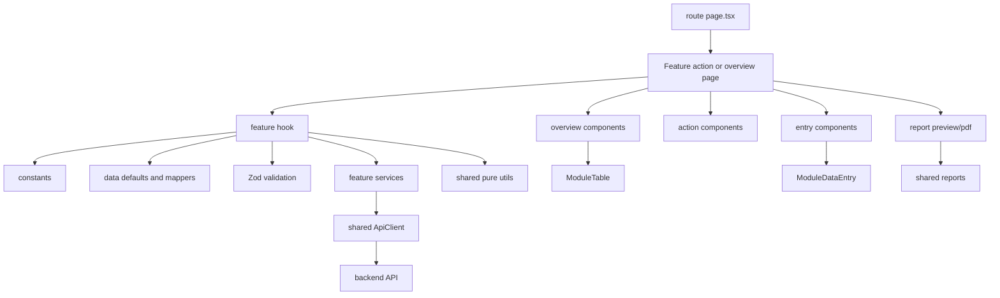
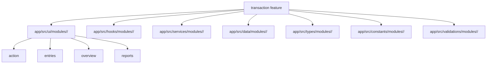

# Gr8Books Neo Frontend Transaction Map

Last updated: 2026-08-20

Use this file as the first stop before changing transactional frontend modules.
It repeats the useful structure from `FRONTEND_MAP.md`, but narrows the guidance
to transaction features that have overview lists, add/edit/view action pages,
entry grids, file attachments, and report previews.

This structure is strictly for transactional modules only, such as sales,
purchasing, inventory, cash receipt, cash disbursement, accounts payable, and
general journal transactions. Do not use this structure for maintenance modules
or system administration modules. Some existing transaction folders still use
older names such as `form/`, `<ModuleName>ListPage.tsx`, or feature files
directly under the feature root. Do not copy those older layouts for new
transactional work unless you are only making a small local fix inside an
existing transaction feature, or unless the task explicitly asks to format that
existing transaction feature using this structure.

## Quick Facts

- Framework: Next.js App Router, React, TypeScript.
- Transaction routes live under `app/(modules)/<domain>/<feature>/`.
- Transaction UI lives under `app/src/ui/modules/<domain>/<feature>/`.
- Non-UI transaction code lives in matching `app/src/{hooks,services,data,types,constants,validations}/modules/<domain>/<feature>/` folders.
- Import alias: `@/*` maps to the repo root.
- Shared entry grid UI: `ModuleDataEntry`.
- Shared report UI: `app/src/ui/shared/reports`.
- Validation belongs in Zod files under `app/src/validations/...`.
- API calls use the shared `ApiClient`.
- Shared utilities must come from `app/src/utils/`.
- Shared date filters must use `DateRangePicker` from
  `app/src/ui/shared/date-range-picker/DateRangePicker.tsx`.
- Shared amount filters must use `AmountRangePicker` from
  `app/src/ui/shared/amount-range-picker/AmountRangePicker.tsx`.
- Feature-specific entry row utilities stay in `entries/utils/`.
- Check [FRONTEND_UTILITY.md](FRONTEND_UTILITY.md) before adding or duplicating
  a helper.
- Read
  [ModuleInteractionSafetyPatterns.md](app/src/agents/modules/deduplication%20&%20optimistic/ModuleInteractionSafetyPatterns.md)
  for guidance on request deduplication, action submit locks, dirty checking,
  optimistic updates, and draft autosaving.

## Transaction Runtime Graph



## Top Actions And Quick Tour

Do not duplicate global top-bar actions inside a transaction list header. If
the main app header already provides Quick Tour, Import, Export, or similar
module-level actions, the transaction overview header should not add a second
copy of those buttons.

For Quick Tour support, expose stable spotlight targets instead of adding a
local Quick Tour button. Use these default ids on list pages:

```txt
data-spotlight-id="maintenance-create-record"  # primary add/start action
data-spotlight-id="maintenance-table-filters"  # search and filters toolbar
data-spotlight-id="maintenance-table-options"  # column visibility and refresh
data-spotlight-id="maintenance-table"          # table wrapper
```

Register every transaction overview that supports the top-bar Module Guide in
`app/src/data/shared/tour/SpotlightTutorialData.ts`. Add its canonical overview
href to `MaintenanceSpotlightTutorialConfigs`; the shared registry then exposes
the guide action without feature-local buttons or route components. Use
`addMode: "none"` until a dedicated add-form guide has been authored. Register
only modules with implemented overview UI and meaningful guide content. Do not
register placeholder or empty modules merely to show an introduction. Once an
overview is implemented, register it and provide the applicable stable targets
above.

## Route Areas

Transactional features are usually inside these module domains:

- `app/(modules)/sales/<feature>/`
- `app/(modules)/purchasing/<feature>/`
- `app/(modules)/inventory/<feature>/`
- `app/(modules)/cash-receipt/<feature>/`
- `app/(modules)/cash-disbursement/<feature>/`
- `app/(modules)/accounts-payable/<feature>/`
- `app/(modules)/general-journal/<feature>/`

Route files stay thin. They should import and render UI from `app/src/ui/...`.

```txt
app/(modules)/<domain>/<feature>/
  page.tsx
  add/page.tsx
  edit/[recordId]/page.tsx
  view/[recordId]/page.tsx
```

Use `page.tsx` for the overview list. Use `add`, `edit/[recordId]`, and
`view/[recordId]` for the shared transaction action screen. Never use
`/add/new`.

## Source Directory Graph



### What Belongs Where

- `app/src/ui/...`: React components only.
- `app/src/hooks/...`: form state driven by the explicit route mode, table state, entry row state,
  submit orchestration, upload orchestration, and navigation handlers.
- `app/src/services/...`: API wrappers, query keys, server actions, upload and
  download calls, and external operations.
- `app/src/data/...`: initial values, mock/static records, row defaults, and
  pure record/form mappers.
- `app/src/types/...`: TypeScript-only record, form, entry, status, mode,
  attachment, filter, and error types.
- `app/src/constants/...`: hrefs, labels, status options, table columns,
  pagination keys, entry tabs, visible-column options, and static select
  options.
- `app/src/validations/...`: Zod schemas, cross-field validation, required-row
  checks, duplicate checks, debit/credit balance checks, and error mapping.
- `app/src/utils/...`: generic, pure formatting and normalization helpers shared
  across unrelated modules.

Keep one canonical constant for each value within a module. Do not create a
second constant that only aliases an existing constant from the same module,
as this adds another name without introducing a distinct value or contract.
Import and use the canonical constant directly. If the original name is too
specific for all of its uses, rename it to an accurate shared name and update
its consumers instead of adding an identical alias.

```ts
// Avoid: both names represent exactly the same value in the same module.
export const StatusActionButtonClassName = "...";
export const ViewActionButtonClassName = StatusActionButtonClassName;

// Prefer: consumers use the single canonical constant directly.
export const StatusActionButtonClassName = "...";
```

Only keep an alias when it is an intentional, temporary compatibility boundary
for external consumers or a rename migration; document why it exists and when
it can be removed.

Route link constants must come from the module catalog. Import
`getModuleRoute` from `app/src/data/shared/modules/ModuleCatalogData.ts`, then
export the feature href from the matching module code instead of duplicating the
route string:

```ts
import { getModuleRoute } from "@/app/src/data/shared/modules/ModuleCatalogData";

export const <ModuleName>Link = getModuleRoute("<ModuleCode>");
export const <ModuleName>AddLink = `${<ModuleName>Link}/add`;
export const get<ModuleName>EditLink = (recordId: string) => `${<ModuleName>Link}/edit/${recordId}`;
export const get<ModuleName>ViewLink = (recordId: string) => `${<ModuleName>Link}/view/${recordId}`;
```

Use the exported list, add, edit, and view link constants/builders in UI files.
Do not assemble route suffixes such as `/add`, `/edit/${recordId}`, or
`/view/${recordId}` inside React components.

Do not put hooks, API calls, application state, validation rules, constants,
types, or data mappers inside transaction UI folders. Feature-specific entry
row UI helpers may live in `entries/utils/`. When utility logic is shared or
reusable across modules, import an existing helper from `app/src/utils/` before
adding a new one. See [FRONTEND_UTILITY.md](FRONTEND_UTILITY.md) for the
current utility list.

## Current Transaction Feature Pattern

Follow this structure strictly for transactional modules. Create only the files
the transaction actually uses, but do not add alternative folders or rename the
standard folders. Tab panels are composed directly in `<ModuleName>ActionPage.tsx`
using their respective `<ModuleName>[TabName]Fields.tsx` components (e.g.,
`<ModuleName>DetailsFields.tsx`, `<ModuleName>FileAttachmentFields.tsx`). Do not
create separate `<ModuleName><TabName>Tab.tsx` wrapper files.

```txt
app/src/ui/modules/<domain>/<feature>/
  action/
    <ModuleName>ActionPage.tsx
    <ModuleName>ActionHeader.tsx
    <ModuleName>ActionHistory.tsx
    <ModuleName>StatusActions.tsx
    <ModuleName>DetailsFields.tsx
    <ModuleName>FileAttachmentFields.tsx
    <ModuleName>NotFound.tsx
    # When the form has additional tabs/sections:
    <ModuleName><TabName>Fields.tsx
  entries/
    utils/
      <ModuleName>EntryRowUtils.ts
    <ModuleName>EntryCellControls.tsx
    <ModuleName>EntrySection.tsx
    <ModuleName>EntryTabs.tsx
    <ModuleName>LineColumns.tsx
  overview/
    <ModuleName>OverviewPage.tsx
    <ModuleName>RecordActions.tsx
    <ModuleName>TableCell.tsx
    <ModuleName>TableToolbar.tsx
  reports/
    <ModuleName>Pdf.ts
    <ModuleName>ReportPreview.tsx
```

```txt
app/src/hooks/modules/<domain>/<feature>/
  use<ModuleName>ActionPage.ts
  use<ModuleName>OverviewPage.ts

app/src/data/modules/<domain>/<feature>/
  <ModuleName>Data.ts

app/src/types/modules/<domain>/<feature>/
  <ModuleName>Types.ts

app/src/constants/modules/<domain>/<feature>/
  <ModuleName>Constants.ts

app/src/validations/modules/<domain>/<feature>/
  <ModuleName>Validation.ts

app/src/services/modules/<domain>/<feature>/
  <ModuleName>Service.ts
```

`<domain>` is the business module route segment. `<feature>` is the
transaction feature route segment. `<ModuleName>` is the PascalCase feature
name used in files and exported symbols.

Use the module display name in UI labels with each word capitalized. For
example, `<ModuleName>` in code becomes a readable label such as
`Cash Advance Multiple Entry` in headings, buttons, filters, empty states, and
table labels.

Transaction number and transaction date labels are the exception. Use the
module's short transaction prefix as `[ModulePrefix]`, so the visible labels
are `[ModulePrefix] No.` and `[ModulePrefix] Date`. Use the display prefix
without a trailing separator; when a configured numbering prefix includes a
trailing separator, omit that separator from the label. Keep the full readable
module name for headings, buttons, messages, and other labels.

For transaction UI and frontend source code, use Party terminology exclusively.
Do not use VCE in visible copy or in transaction module code, including labels,
placeholders, column names, validation messages, filters, helper text, types,
form fields, constants, hooks, validation keys, table columns, component props,
local variables, or seed identifiers. Use `partyCode` and `partyName`, never
`vceCode` or `vceName`. When a legacy backend or another module still exposes a
VCE-shaped contract, isolate that translation at its integration boundary and
export a Party-named adapter; transaction feature code must consume only the
Party-named result.

## Route Files

Overview route:

```tsx
import { <ModuleName>OverviewPage } from "@/app/src/ui/modules/<domain>/<feature>/overview/<ModuleName>OverviewPage";

export default function Page() {
  return <<ModuleName>OverviewPage />;
}
```

Action routes:

```tsx
import { <ModuleName>ActionPage } from "@/app/src/ui/modules/<domain>/<feature>/action/<ModuleName>ActionPage";

// add/page.tsx
export default function AddPage() {
  return <<ModuleName>ActionPage mode="add" />;
}

// edit/[recordId]/page.tsx
export default function EditPage() {
  return <<ModuleName>ActionPage mode="edit" />;
}

// view/[recordId]/page.tsx
export default function ViewPage() {
  return <<ModuleName>ActionPage mode="view" />;
}
```

Use the same `ActionPage` import for `add/page.tsx`,
`edit/[recordId]/page.tsx`, and `view/[recordId]/page.tsx`, but pass the action
mode explicitly from each route. The typed `ActionPage` prop passes that mode
to its hook. Do not call `usePathname`, inspect route strings, or define a
`getActionMode(pathname)` helper to infer add, edit, or view mode.

## Action Folder

`<ModuleName>ActionPage.tsx`

- Top-level add/edit/view transaction screen.
- Requires a typed `mode` prop from its route and passes it to
  `use<ModuleName>ActionPage`.
- Calls `use<ModuleName>ActionPage`.
- Composes `<ModuleName>ActionHeader`, tabs, detail fields, entries,
  attachments, report preview, and drawers.
- Does not define validation rules, API calls, row defaults, or large mappers.
- Does not define header button groups, action title helpers, action
  description helpers, or status action controls; put those in
  `<ModuleName>ActionHeader.tsx`.
- When the form has multiple tabs, composes the appropriate `<ModuleName>[TabName]Fields.tsx`
  components (e.g., `<ModuleName>DetailsFields.tsx`, `<ModuleName>FileAttachmentFields.tsx`)
  directly in `ActionPage.tsx` based on `activeTab`.
- Starts new unsaved transactions with the placeholder status `Open`.
- Uses `action/<ModuleName>NotFound.tsx` for missing records in edit/view mode.

`<ModuleName>NotFound.tsx`

- Transaction-specific missing-record state for edit/view action routes.
- Prefer shared `ModuleNotFound` when custom behavior is not needed.
- Keep this component in `action/`, because it belongs to action routes and not
  the overview table.

`<ModuleName>ActionHeader.tsx`

- Transaction mode, document number, status, and primary actions.
- Can include save, post, approve, void, print, preview, duplicate, and back
  controls.
- Use icon buttons with `ModuleTooltip` when labels are hidden.
- Follows the default mode button sets and button tones described below.
- Owns action button rendering and header-only icon imports. Keep `ActionPage`
  free from these header details.
- Owns the confirmation state and renders `AppDialog` for Save, Save as Draft,
  Update, and lifecycle/status actions. Hooks may own validated pending values
  and persistence callbacks, but `ActionPage` and lifecycle `StatusActions`
  components must not render these confirmation dialogs.
- Keep lifecycle `StatusActions` presentational: it may build responsive action
  buttons and menus, but it reports the requested status back to
  `ActionHeader`, which opens and resolves the confirmation dialog.
- Keep confirmation titles, labels, and other reusable action copy in the
  feature constants or data layer. Do not define pure copy-building helpers
  such as `getDialogTitle` inside `ActionHeader`.

`<ModuleName>StatusActions.tsx`

- Owns view-mode lifecycle and status transition action controls (Approve, Disapprove, Cancel, Undo, etc.).
- Renders responsive action options: `ModuleActionMenu` on mobile (< `lg`) and action buttons on desktop (`lg:flex`).
- Standardized styling via `CashDisbursementStatusActionButtonClassName` (or domain-specific status button classes).
- Presentational: triggers requested status callbacks back to `<ModuleName>ActionHeader.tsx`, which triggers the confirmation dialog.

`<ModuleName>ActionHistory.tsx`

- Owns the action-page History button, its open/close state, and the mapping of
  the current transaction record into history entries.
- Uses the shared `ModuleHistoryDialog`; do not recreate transaction history
  dialog chrome inside the feature.
- Keep this file module-specific even when two transaction record shapes are
  similar. Each module should own its labels, event descriptions, identifiers,
  and record-to-history mapping instead of importing another feature's Action
  History component.
- Compose it from `<ModuleName>ActionHeader.tsx` for edit/view modes where a
  record exists. Do not embed history dialog state or history-entry builders in
  `ActionHeader`, `ActionPage`, or lifecycle `StatusActions` components.

`<ModuleName>DetailsFields.tsx` / `<ModuleName>[TabName]Fields.tsx`

- Header/detail fields such as party, warehouse, date, terms, reference,
  currency, project, branch, responsibility center, and remarks.
- Receives values, errors, readonly state, and field update callbacks.
- Uses real `<label>` elements and marks required fields with a red `*`, using
  the shared field shell's required marker instead of embedding `*` in label
  strings.
- Use the `[Label] [Input Field]` field layout in transaction detail forms:
  label on the left, input/control on the right, with validation text below the
  input/control.
- Render field labels with `text-sm font-semibold text-darknavy`. Render
  editable input and selected-control text with
  `text-sm font-medium text-darknavy`; use `text-darknavy/35` only for
  placeholder text. Do not reduce active label or entered-value contrast with
  feature-local opacity classes.
- Render readonly values with the shared muted readonly field color from
  `app-data-entry-field` instead of applying a feature-local text color. This
  keeps readonly text visibly distinct while preserving theme support.
- Write placeholders in title case: capitalize significant words and keep
  short articles, conjunctions, and prepositions such as `a`, `an`, `the`,
  `and`, `or`, `is`, `of`, `to`, and `for` lowercase unless they are the first
  or last word. For example, use `Select Responsibility Center` and
  `Search VAT Rate or Description`.
- Keep control placeholders on one line. When the available field or Data Entry
  column width is too narrow, truncate the placeholder with an ellipsis instead
  of wrapping or increasing the row height. Preserve the full placeholder as
  accessible or hover text in shared controls.
- Keep all standard transaction controls in the same row height. Text inputs,
  selects, money inputs, date inputs, readonly code fields, status fields, and
  `AppAdvancedDropdown` controls should use the shared transaction field height
  so adjacent fields align visually.
- Use the three-column transaction detail format: Name, Code, Transaction.
  The first column contains name fields, the second column contains their
  matching code fields, and the third column contains transaction identity
  fields.
- Keep the standard first-column order, when those fields apply: `Party Name`,
  `Responsibility Center`, `Project Name`, `Default Account Title`, then
  `Remarks`. Keep the matching second-column order: `Party Code`,
  `Responsibility Center Code`, `Project Code`, `Default Account Code`, then
  `Currency` and its exchange rate control.
- Use `Responsibility Center` and `Responsibility Center Code` as the strict
  field labels and model identity. Cost center, profit center, and similar
  classifications are selectable Responsibility Center data; do not replace
  the field identity or visible label with a classification name.
- Align name/code pairs by row. For example, `Party Name` aligns with
  `Party Code`, and `Account Title` aligns with `Account Code`.
- The Transaction column contains `[ModulePrefix] No.`, `[ModulePrefix] Date`,
  and `Status`. Use the module's short transaction prefix for both labels; do
  not repeat the full module name or use generic `Transaction No.` and
  `Transaction Date` labels.
- Transaction number behavior depends on the module's transaction-number
  setup. When the module is configured for automatic numbering, generate the
  `[ModulePrefix] No.` value from the configured prefix plus a six-digit padded
  sequence, such as `<MODULE_PREFIX>-000001`, and render the field readonly.
  When the module is configured for manual numbering, do not generate a default
  value and render the field editable so the user can enter the number.
- Display transaction dates in the readable date-only format, such as
  `Jan 22, 2026`. Use `formatDate` from `app/src/utils/date.util.ts` for
  date-only UI values. Use `formatDateTime` only when the UI intentionally
  needs time. Keep ISO values such as `2026-01-22` only for native date inputs,
  API payloads, and internal form values.
- For the `[ModulePrefix] No.` input placeholder, use title case. Use
  `Auto Generated [ModulePrefix] Transaction Number` for automatic numbering
  and `Enter [ModulePrefix] Transaction Number` for manual numbering.
- Render action-page Status as a readonly input/display field. Do not use a
  dropdown for Status in the transaction detail form; lifecycle changes belong
  in the header actions or approval controls.
- Readonly transaction inputs, including generated numbers, aligned code
  fields, calculated amounts, and status fields, must use the shared gray
  readonly field styling so they are visibly non-editable.
- Use `AppLimitedTextarea` from `app/src/ui/shared/app/AppLimitedTextarea.tsx`
  for Remarks. Keep the standard 500-character limit and visible counter. For
  transaction action page remarks, render it in one column only at the end of
  the first column, and allow both vertical and horizontal resize with the
  `resize` class while keeping it constrained to its column, unless a module
  has a documented layout exception.
- Money amount inputs should use `MoneyNumberField` from
  `app/src/ui/shared/money/MoneyNumberField.tsx`. Amount fields are
  right-aligned with tabular numbers, use money formatting, and display two
  decimal places by default, such as `.00`, after blur and for loaded values.

Shared transaction field controls

- Use `TransactionField` from
  `app/src/ui/shared/transaction-setup/TransactionFormFields.tsx` for the
  standard label, required marker, error message, and compact/full-width field
  layout. Do not create a feature-specific `FieldShell` with the same behavior.
- Do not create `<ModuleName>FieldControls.tsx` by default. Compose shared
  controls directly in `<ModuleName>DetailsFields.tsx`. When a feature has a
  genuinely unique control reused in several places, give it a specific name
  that describes its purpose and keep its types in `<ModuleName>Types.ts`.
- Option lists belong in constants. API-backed lookup behavior belongs in hooks
  or services.
- Transaction lookup fields should use `AppAdvancedDropdown` from
  `app/src/ui/shared/advanced-dropdown/`. When a single-select lookup needs to
  return both the selected option code and name, use the shared
  `AppLookupDropdown` instead of creating a feature-specific wrapper. Use
  `addAction` for inline Add behavior on these fields:

```txt
Party Name
Payment Type
Bank
Responsibility Center
Project Name
Expenses
Collection
Services
Discount
Terms
```

- Every `AppAdvancedDropdownOption.value` must be the stable backend record ID
  or business code. Display text belongs in `name` and `label`; never store a
  display name as the option value.
- Lookup option sources must include the saved record selected by an edit/view
  form. Do not patch incomplete lookup data by appending synthetic options in
  `DetailsFields`; fix the constants, mapper, query, or service that supplies
  the options.
- Account lookup fields such as `Account Title` and `Default Account Title`
  should also use the shared advanced dropdown, but should not show an inline
  Add button unless the module has a documented chart-account creation flow.
- Add actions for maintenance-backed lookup fields listed above should open a
  right-side `ModuleDrawer` UI, not an inline form, centered dialog, or page
  navigation. Follow the maintenance drawer pattern: blurred/dimmed backdrop,
  right-side panel, eyebrow, title, description, close button, scrollable form
  body, and sticky footer actions such as `Cancel` and `Save [RecordName]`.
  Reuse the actual maintenance drawer component for the lookup:

```txt
Party Name -> PartyManagementDrawer
Payment Type -> PaymentTypeDrawer
Bank -> BankMasterfileDrawer
Responsibility Center -> ResponsibilityCenterDrawer
Project Name -> ResponsibilityCenterDrawer
Expenses -> DefaultAccountDrawer
Collection -> DefaultAccountDrawer
Services -> ServicesMaintenanceDrawer
Discount -> DiscountMaintenanceDrawer
Terms -> TermsMaintenanceDrawer
```

Keep drawer open state in the transaction action page and pass an
`onSaved`/create callback that selects the newly saved record back into the
active transaction field and its aligned readonly code field before closing
the drawer.

#### Drawer-only Maintenance Add Rule

This rule is mandatory for every transaction module, including all module
header fields and Data Entry lookups. A maintenance-backed
Add action must render the maintenance module's actual `*Drawer` component.
Do not use `AppPartyDialog`, `ProjectNameDialog`, a feature-local quick-add
modal, or any other centered dialog as a maintenance creation surface. Name
the related state, callbacks, and props with `Drawer` as well, so the intended
interaction cannot be mistaken for a modal during later maintenance.

Dialogs remain appropriate for confirmation, import mapping/preview, report
preview, attachment details, tax calculation, and expanded text editing. They
must not be used to create maintenance records.

- Keep the `AppAdvancedDropdown` remove/clear button enabled by default. When a
  name lookup clears, also clear its aligned readonly code field so placeholders
  appear muted and do not look like entered values.

`<ModuleName>FileAttachmentFields.tsx`

- Upload, display, remove, and readonly attachment UI.
- Use the shared transaction attachment component:
  `app/src/ui/shared/transaction-setup/TransactionFileAttachmentFields.tsx`.
- Attachment state and upload orchestration belong in hooks or services.

## Action Page Defaults

### Transaction Number

Transaction number behavior must follow the module's transaction-number setup.
For automatic numbering, generate the transaction number from the module
transaction prefix and a six-digit padded sequence using the format
`<MODULE_PREFIX>-000001`; keep the field readonly in the action page once a
value is assigned, and let the backend or configured transaction-number service
own the final sequence assignment.

For manual numbering, do not generate a transaction number in defaults or form
initializers. Start with an empty value, keep the `[ModulePrefix] No.` field
editable in add/edit modes, and validate it as a required user-entered field.

### Status

Use `Open` as the beginning placeholder status for a brand-new unsaved
transaction. `Open` is not an official saved status. Do not display `Draft`
until the user saves the transaction as draft.

### Header Title

View and edit action pages should use this title format:

```txt
[Action] [ModuleName] | [[ModulePrefix] No.] [Status Badge]
```

Use the existing shared transaction status badge for `[Status Badge]`.

### Header Buttons

Add mode header buttons:

```txt
Back
Preview
Copy From
Save
Save As Draft
```

View mode header buttons:

```txt
Back
Preview
History
Approve
Disapprove
Cancel
Copy To       # show when already approved
Edit          # show when editable, such as not for approval or draft
```

Edit mode header buttons:

```txt
Back
Preview
Approve
Disapprove
Cancel
Save
```

Use the shared action control for transaction action headers:

```tsx
import { ModuleActionButton } from "@/app/src/ui/shared/module/ModuleActionButton";
```

Render primary or secondary header actions with `<ModuleActionButton />`. It
defaults to the Save label and icon, but callers may supply another label,
icon, and `onAction` callback for actions such as Preview. When an action needs
related options such as Save As Draft or alternate preview formats, pass them
through `menuItems` instead of creating a separate custom split button.

#### Copy From

Use the shared Copy From control for transaction action headers:

```tsx
import { AppCopyFromDropdown } from "@/app/src/ui/shared/transaction-setup/AppCopyFromDropdown";
```

Render the trigger with `<AppCopyFromDropdown />`; do not create a feature-local
Copy From button, dropdown, source menu, or source-record dialog. The shared
trigger must use this standard presentation:

```txt
Label          # Copy From
Leading icon   # Copy
Trailing icon  # ChevronDown
Color          # standard neutral secondary header action
```

The trigger uses `moduleHeaderActionClassNames.secondary`: white background,
dark text, neutral border, and the same height and padding as the regular Back,
Preview, and History buttons. Do not use the module accent as the default Copy
From background. Keep both icons at `h-4 w-4` and retain the visible `Copy From`
label; do not reduce it to an icon-only action.

`sources` contains readable source-module labels and creates the dropdown menu
used to choose which module to copy from. Render a source chooser even when the
current implementation has only one source. Each `AppCopyFromRecord.source`
must exactly match one of the `sources` labels so the shared dialog can filter
the records correctly.

```tsx
<AppCopyFromDropdown records={copyFromRecords} selectionMode="single" sources={[...copyFromSources]} onApply={copyFromSourceRecords} />
```

Use `selectionMode="single"` when the transaction can copy only one source
record. Use `selectionMode="multiple"` only when combining several source
records is a supported business operation. Keep readable source labels in the
feature constants, source-record data or mapping in the feature data/service,
and the `onApply(recordIds)` state update in the action-page hook. Preserve the
new transaction number, current status, and fields that the copy operation is
not intended to replace.

Show Copy From in add mode by default. Disable it when there are no available
sources or hide it when copying is not supported. Selecting a source opens the
shared searchable and filterable source-record dialog; applying a selection
must populate the action form and provide success or error feedback.

Regular Save must run the module's full validation before persisting. Save As
Draft is intentionally more permissive: it should persist the user's current
incomplete data without running full required-field, line-completeness,
duplicate, or balancing validation. Use only lightweight draft-safe checks when
needed to protect storage or routing, such as a valid generated transaction
number in automatic-numbering modules.

Every state-changing transaction action must use
`app/src/ui/shared/app/AppDialog.tsx` for confirmation. This includes Save,
Save As Draft, Update, Submit for Approval, Approve, Disapprove, Reject, Post,
Cancel, Delete, Void, Close, Reopen, Undo Approved, Undo Disapproved, Undo
Cancelled, and equivalent lifecycle or status-reversal actions. Undo actions
must follow the same confirmation requirement as their forward actions. Do not
execute the action directly from its button or menu item.

Always follow this order: **Validation First, then AppDialog Confirmation**.
When an action requires validation, run its applicable validation before
opening the confirmation dialog. If validation fails, show the field and/or
toast errors and do not open `AppDialog`. If validation passes, open
`AppDialog`; execute the state-changing action only after the user confirms.
Save As Draft may use only the draft-safe checks described above, but it still
requires `AppDialog` confirmation after those checks pass.

While the confirmed action is running, disable duplicate submissions and use a
clear pending label such as `Saving...`, `Updating...`, `Approving...`,
`Disapproving...`, or `Cancelling...`. For maintenance drawers, use the
`ModuleDrawer` managed footer/save flow when possible, including
`getModuleSavePendingLabel(mode)` for add/edit saves.

Use Title Case for successful transaction feedback, including the module name
and completed action. For example, use `[Module Name] Created.` instead
of `[Module name] created.` Apply the same pattern to Created, Updated,
Saved, Submitted, Approved, Disapproved, Posted, Cancelled, Deleted, and other
completed transaction actions.

Every visible action button must invoke working behavior; do not leave lifecycle,
save, history, copy-from, or navigation actions wired to `() => undefined` or an
empty handler. Hide or disable unfinished actions. A visible deferred Preview
action is allowed only when the module request explicitly scopes Preview out for
the current implementation.

Use these default action-header button icons and color patterns:

```txt
Back         # ArrowLeft, neutral white button, dark text
Preview      # FileText, neutral white button, dark text
History      # History, neutral white button, dark text
Copy From    # Copy + ChevronDown, neutral white button, dark text
Approve      # ThumbsUp, green/success outline, green text
Disapprove   # ThumbsDown, red/danger outline, red text
Cancel       # Ban, orange/yellow warning outline, orange text
```

Back, Preview, History, and Copy From should use the standard secondary header
action style. Approval lifecycle buttons should be outlined status actions: green for
Approve, red for Disapprove, and orange/yellow for Cancel. Keep their default
background white, and use only a light matching tint for hover and focus states.

This action-header pattern is separate from list-page row `ActionMenu`
behavior. Do not copy row action menu icon/tone rules into the action page
header, and do not force action-header button styling into dense list-page
menus.

### Shared Module Table Sizing

All module lists must inherit their default table and filter sizing from the
shared `module-table` components. Do not size columns from header or cell text.

- `ModuleTable` uses a fixed table layout by default so ordinary columns share
  the available width consistently and header text cannot resize them. Give
  semantic compact columns explicit TanStack metadata widths, such as
  `w-[8rem]` for Status and `w-[9rem]` for Actions. The shared header honors
  these widths.
- Use `useColumnSizing` only for tables that intentionally define TanStack
  pixel `size` values and need a generated `colgroup`. Do not enable it on a
  normal module list, because its `colgroup` takes precedence over metadata
  width classes.
- Keep every header on one line. When its label is wider than the available
  column, truncate it with an ellipsis and preserve the complete label in the
  native hover title. A long label must never expand the column.
- Use `ModuleTableToolbar`, `ModuleTableSearch`, and
  `ModuleTableFilterSelect` for list filters. The shared default gives Search
  the flexible leading track and gives every filter an equal-width track with
  a 12-rem minimum.
- Keep the transaction Search, Date Range, Amount Range, Status, Column
  Visibility, and Refresh composition in the feature-owned
  `overview/<ModuleName>TableToolbar.tsx`. Build it from the shared controls in
  `ModuleTableToolbar.tsx` so each module can adjust its filters and responsive
  layout independently as its requirements evolve.
- Module-specific responsive wrappers may change the number of grid columns,
  but sibling filter tracks must remain equal width. Do not use different
  widths based on label length; long filter labels and selected values must
  truncate instead.
- Keep Column Visibility, Refresh, Export, and other icon-only utilities in
  fixed-width action tracks so they do not affect filter widths.

### Transaction Tabs

Every transaction action page has at least these tabs:

```txt
[ModuleDetailName] Details
File Attachments
```

Render these tabs directly under the action header with the shared
`ModuleTabs` component. Details and File Attachments should appear as full-width
tab panels. Do not show a separate side attachment card when File Attachments
is one of the standard tabs.

For the File Attachments tab, use
`app/src/ui/shared/transaction-setup/TransactionFileAttachmentFields.tsx`. It
provides the standard full-width upload dropzone, attachment count/list,
download/remove controls, and empty state. Feature wrappers should only pass the
local `uploadTitle`, `inputId`, `inputName`, `attachments`, `isReadonly`, and
`onAttachmentsChange`. Use `formatFileSize` from `app/src/utils/file.util` for
any attachment size display instead of adding local file-size formatting.

Transactions may add more tabs when needed. When rendering tab panels, compose
the respective `<ModuleName>[TabName]Fields.tsx` components directly in
`<ModuleName>ActionPage.tsx`. Do not create intermediate `<ModuleName><TabName>Tab.tsx`
wrapper files.

### Currency And Exchange Rate

Do not use `CurrencyExchangeRateRow` in transaction detail forms. Instead, each module renders separate `TransactionField` controls for Currency and Exchange Rate:

```tsx
<TransactionField label="Currency" error={errors.currency}>
  <AppAdvancedDropdown
    id="<prefix>-currency"
    value={values.currency}
    readOnly={isReadonly}
    isClearable={false}
    menuMinWidth={320}
    options={currencyOptions}
    placeholder="Currency"
    searchPlaceholder="Search Currency"
    onChange={(value) => onCurrencyChange(String(value))}
  />
</TransactionField>

<TransactionField label="Exchange Rate" error={errors.exchangeRate}>
  <input
    id="<prefix>-exchange-rate"
    type="text"
    inputMode="decimal"
    value={values.exchangeRate}
    readOnly={isReadonly}
    disabled={isReadonly || isExchangeRateLoading}
    onChange={(event) => onUpdateField("exchangeRate", formatExchangeRateInput(event.target.value))}
    className={`${TransactionFieldClassName} text-right tabular-nums${isReadonly || isExchangeRateLoading ? " transaction-readonly-placeholder" : ""}`}
    placeholder="0.00"
  />
</TransactionField>
```

Give the `AppAdvancedDropdown` menu an extended minimum width with `menuMinWidth={320}`. The options menu may be wider than the closed control and must use the shared portal positioning, which clamps it to the available viewport. This width leaves enough room to show the currency code first and the currency name or description second without premature truncation.

Build transaction Currency options from the shared currency references and configured multi-currency rates. Use the active company's base currency as the default; do not hardcode feature-local lists or assume a particular base currency. Map the catalog records to readable dropdown options and identify the configured default currency in the option details.

Selecting a Currency should resolve its configured Exchange Rate against the active company's base currency. Display and initialize the base currency rate as `1.00`, disable the rate control while a selected rate is loading, and show a field error plus a toast when the rate cannot be loaded. Ignore stale responses when users change the selection quickly. Keep Exchange Rate editable in add and edit modes and make it readonly only in view mode. Use `formatExchangeRateInput` from `app/src/utils/number.util.ts` to normalize manual decimal input consistently across transaction forms.

## Entries Folder

`<ModuleName>EntrySection.tsx`

- Main line-entry area for items, services, accounts, allocations, taxes, or
  charges.
- Renders shared `ModuleDataEntry` for spreadsheet-like transactions.
- Receives rows, columns, errors, readonly state, totals, and row actions from
  the hook.
- The `description` prop is optional. Omit Data Entry descriptions by default;
  the title, tabs, count, column headers, and controls normally provide enough
  context. Add a description only when the grid needs essential instructions
  that are not already communicated by those elements. Do not add generic
  explanatory copy that merely restates what users enter in the table.
- Treat the Remarks editor subtitle or description as optional. Omit it by
  default, especially generic copy such as `Accounting entry`; show a subtitle
  only when it adds row-specific context that is not already clear from the
  dialog title and field label. When the dialog title is `Remarks`, do not add
  a redundant `Details` field label; render the visible title itself as the
  textarea's `<label>` with a matching `htmlFor`/`id` relationship.
- Pass a singular semantic `emptyRowLabel` using the itemization module name.
  The shared Data Entry count formatter renders the header badge and footer
  count in title case and pluralizes it when needed, following the generic
  pattern `[No of Item] [ModuleNameForItemization] Items`. Do not render a
  feature-local count label or apply sentence case to either location.
- Keep Data Entry header, count badge, grid controls, rows, and footer sizing
  consistent throughout the transaction module. Use the shared component without
  overriding its shell spacing: header `px-4 py-3`, count badge `h-6 px-2.5`,
  footer `px-5 py-3`, entry controls `h-10 px-3 text-sm`, header action buttons
  `h-9 px-3`, and entry-tab buttons `h-8 px-3`.
- Use fixed default widths for transaction entry columns and pass
  `widthMode: "fixed"` in both the rendered column and its column option. Keep
  widths in feature constants, clamp interactive resizing through the shared
  `clampColumnWidth`, and use horizontal scrolling when the configured grid is
  wider than its container. Do not compress columns until their controls or
  values become unreadable merely to avoid horizontal scrolling.
- Every configurable transaction entry grid must keep ordered column ids,
  visible column ids, labels, and widths as state and wire the shared
  `ModuleDataEntry` callbacks for column drag/reorder, visibility, manual
  resize, fit/auto width, rename, and reset. The header `Column` control and
  per-header drag handle, options menu, and resize handle must come from the
  shared component rather than feature-local controls.
- When a Data Entry section has multiple tabs or views with different column
  sets, keep independent order, visibility, label, and width state for each
  tab. Switching tabs must restore that tab's configuration, and Reset must
  reset only the active tab to its documented defaults.
- A generated or calculated grid may keep its rows readonly while still
  allowing column configuration during add/edit mode. Use
  `canConfigureColumnsWhenReadonly` for that case; do not enable configuration
  on the transaction's fully readonly View page unless explicitly required.
- Protect only the essential identifying entry columns from being hidden.
  Other entry columns must be available in the shared visibility list, and
  Reset must restore the documented order, visibility, labels, and widths.
- Keep long entry headers and cell placeholders on one line with ellipsis
  truncation. Activating configurable headers must not change feature-specific
  row sizing; retain the shared `min-h-9` header content and `h-10` entry
  control heights.
- Use `footerDetails` for the standard centered transaction total with
  `text-sm font-semibold text-darknavy`. Keep the generated entry count on the
  left and the shared row actions on the right; do not shrink, pad, or position
  these footer areas per feature.
- Use the centered `footerDetails` content according to the active Data Entry
  view. A detail, item, expense, service, or equivalent transaction view shows
  `Total Amount`. An `Accounting Entries` view shows `Variance`, calculated as
  the absolute difference between total Debit and total Credit. Do not show
  `Total Amount` in the Accounting Entries footer or use `Variance` as the
  detail-view footer label.
- The Accounting Entries variance is stateful feedback. Render zero variance
  with the success color (`text-emerald-700`) and any non-zero variance with
  the error/accent color (`text-coralpink`). Use the same currency formatter
  and precision as Debit and Credit, and use a small tolerance such as `0.001`
  when testing whether the calculated variance is zero.
- A valid Accounting Entries set must always balance: total Debit must equal
  total Credit and Variance must be zero. Keep Debit and Credit totals in the
  shared summary row, calculate balance in the feature hook or data layer, and
  enforce it in the feature validation. Full Save, Update, Submit, Approve,
  Post, and equivalent completion actions must not proceed while the entries
  are out of balance. The documented Save As Draft validation exception still
  applies to incomplete work in progress.

`<ModuleName>EntryTabs.tsx`

- Tab control for multiple entry sets such as Items, Accounts, Taxes,
  Attachments, or Allocations.
- Keep tab ids and labels in constants when reused by hooks or validation.

`<ModuleName>LineColumns.tsx`

- Column definitions for transaction entry rows.
- Uses `EntryCellControls` for editable cells.
- Move reusable visible-column options and add-column options to constants.

`<ModuleName>EntryCellControls.tsx`

- Small editable and readonly cell renderers.
- Examples: item selector, account selector, quantity input, unit price input,
  tax selector, debit/credit input, and row note input.
- Lookup cells must follow the same advanced-dropdown and permission behavior
  as lookup fields in the transaction header. Use `AppAdvancedDropdown` from
  `app/src/ui/shared/advanced-dropdown/` for Party Name, Responsibility Center,
  Project Name, Terms, and the other maintenance-backed lookups listed under
  Shared transaction field controls. VAT Type and EWT must also use
  `AppAdvancedDropdown`; do not render these fields as plain text inputs or
  native selects.
- When a Data Entry lookup is backed by a maintenance module, expose the
  dropdown `addAction` only in editable modes and only when the current user has
  Create access to that maintenance module. The Add action opens the same
  right-side maintenance drawer used by the corresponding header lookup and
  selects the newly created record into the active row after a successful save.
  Do not show a non-functional or unauthorized Add action.
- Every maintenance-backed Data Entry lookup must keep both the selected record
  code and name in the row model. In advanced-dropdown options and search
  results, present `Code` first and `Name` second. In the grid, keep the paired
  Code column immediately before its Name column in the canonical column order,
  but hide Code columns by default. Users may reveal them through the shared
  Column Visibility control. Selecting or clearing the Name lookup must update
  or clear its paired Code value in the same state change.
- Use the shared `ModuleDataEntryCheckboxCell` in
  `app/src/ui/shared/module/module-data-entry/ModuleDataEntryCheckboxCell.tsx`
  for boolean Data Entry cells. Use it for the `VATable` and `VATInc` columns
  instead of creating feature-local checkbox markup. It must
  provide an accessible label from the column and row context, use the standard
  Data Entry control sizing and focus treatment, center the checkbox in its
  cell, call a typed boolean change handler, and render a clearly readonly,
  non-interactive state in View mode.
- Every Data Entry column whose canonical label is `Remarks` must use the
  shared `ModuleDataEntryRemarksCell`. Keep the value visible as a truncated,
  single-line cell input with a fixed ellipsis button. The ellipsis button opens
  the shared `ModuleTextareaDialog` titled `Remarks`, with the `Details` label,
  a 500-character limit and visible counter, and Cancel/Save actions. In
  readonly mode, keep the ellipsis available for reading the complete value and
  show only the dialog Close action. Do not render a plain text input or allow
  the Remarks cell to grow the Data Entry row height.
- Use `Remarks` as the canonical label and `remarks` as the canonical internal
  field/column key for transaction-entry notes. Headers, placeholders, dialogs,
  previews, PDFs, import/export templates, row models, types, constants, data,
  hooks, validations, and services must use the Remarks naming.
- All Cash Disbursement modules must use `remarks` throughout their Data Entry
  and accounting-entry implementation. Do not introduce a `particular` or
  `particulars` field, column ID, label, or feature-specific editor. Import
  parsers may accept `Particular` and `Particulars` only as legacy inbound
  header aliases and must map them immediately to `remarks`.
- Does not mutate row state directly; call typed handlers from props.

`utils/<ModuleName>EntryRowUtils.ts`

- Feature-specific entry row helpers needed only by this transaction entry grid.
- Good for focus movement, local display helpers, row-level UI calculations, and
  conversion between grid events and row update payloads.
- Defaults, record mapping, total calculation, and validation belong in `data`,
  `hooks`, or `validations`.
- Shared helpers used by unrelated modules belong in `app/src/utils/`.

## Overview Folder

`<ModuleName>OverviewPage.tsx`

- Transaction list/search/table landing page.
- Calls `use<ModuleName>OverviewPage` for table state, filters, sorting,
  pagination, data loading, and navigation handlers.
- Uses clickable metrics when they represent a filterable total or status.
- Owns the standard `ModuleStatisticCards` and `ModuleTable` composition. Keep
  metric-card construction and `renderRow` in `OverviewPage`; do not create
  separate `<ModuleName>Metrics.tsx`, `<ModuleName>Table.tsx`, or
  `<ModuleName>TableRow.tsx` wrappers for the standard transaction layout.
  The required overview extraction points are `TableToolbar`, `TableCell`, and
  `RecordActions`.
- Uses the default transaction filters, table controls, columns, and add button
  described below unless the transaction has a documented business exception.
- Uses the feature-owned `<ModuleName>TableToolbar` for its Search, Date Range,
  Amount Range, Status, Column Visibility, and Refresh composition. Build the
  toolbar from the shared primitives exported by `ModuleTableToolbar.tsx`, but
  keep the composition inside the feature so it can evolve independently.
- Delegates overview cell rendering to the feature-owned
  `<ModuleName>TableCell.tsx`. Keep transaction number, amount, date, status,
  and action-cell behavior there instead of creating a shared transaction cell
  renderer or defining a local `renderCell` function in the overview page.
- The feature cell renderer may accept a `renderActions` callback or render its
  `<ModuleName>RecordActions` directly. Choose the feature-specific shape that
  keeps status and action behavior explicit and easy to change.
- Every implemented overview folder should therefore contain the same four
  files: `OverviewPage`, `RecordActions`, `TableCell`, and `TableToolbar`.

`<ModuleName>TableCell.tsx`

- Owns the module's overview-table cell rendering and formatting decisions.
- Handles only the column identifiers supported by that module and returns the
  table column's normal fallback for any unhandled identifier.
- May use shared formatting utilities, `ModuleStatusBadge`, and module-table
  style primitives, but must not depend on a shared transaction overview cell
  renderer. Different transaction modules may change their columns, status
  presentation, amount formatting, or action layout independently.

`<ModuleName>RecordActions.tsx`

- Row-level actions such as view, edit, duplicate, print, post, approve, void,
  cancel, deactivate, or delete.
- Keep action visibility and disabled-state rules readable and close to the
  component unless they are shared business rules.
- Use the shared `ModuleActionMenu` for transaction rows with approval,
  disapproval, cancellation, undo, or other multi-action lifecycle controls.
  Avoid long inline action button groups in dense transaction tables.
- For implemented transaction overview tables, show View and Edit as the first
  two icon controls, followed by `ModuleActionMenu` for lifecycle actions. Keep
  the disabled Edit control in place when the record status is not editable so
  every row remains aligned. Use `ModuleTableActionLink` for enabled View/Edit
  controls and `ModuleTableActionButton` for the disabled Edit state.
- Use consistent action menu icons for approval lifecycles. For cash
  disbursement-style approval menus, use `ThumbsUp` for `Approve`, `Undo2` for
  undo approved/posted states, `ThumbsDown` for `Disapprove`, and `Ban` for
  `Cancel`. Do not use package, cube, or inventory icons for generic approval
  actions.

## Overview Defaults

### Metrics

Metrics may be clickable. When a metric represents a status, clicking it should
apply that status filter to the overview table. Transaction overviews with the
standard lifecycle should use the six-card metric pattern and pass
`className="2xl:grid-cols-6"` to `ModuleStatisticCards`. Each status card should
include a percentage summary such as
`formatPartOfTotalPercentage(statusCount, totalCount)`.

Mock and prototype transaction overviews should contain complete, realistic
row data and at least one representative record for every supported saved
status. This ensures status metrics, filters, badges, action eligibility, and
confirmation flows can all be exercised from the UI.

Mock Party Names must use normal human-readable title casing, such as
`Maria L. Dela Cruz` or `Pacific Office Solutions, Inc.`. Do not seed Party
Names in all caps, and do not preserve legacy `LAST NAME, FIRST NAME` casing in
new or updated transaction mock data.

Use the default labels, `ModuleStatisticCardItem["tone"]` values, and shared
icons below unless the transaction has a documented exception. Metric card
hover, focus, and active outlines should follow the metric tone color, not the
current module/theme accent.

```txt
Total Transaction / Total Entries   # tone="violet", receipt/list icon
Posted          # tone="emerald", getModuleStatusMetricIcon -> CheckCircle2
For Approval    # tone="amber", getModuleStatusMetricIcon -> Clock
Draft           # tone="blue", getModuleStatusMetricIcon -> Clock
Disapproved     # tone="red", getModuleStatusMetricIcon -> XCircle
Cancelled       # tone="slate", getModuleStatusMetricIcon -> Ban
```

For standard lifecycle status metrics, use the shared helpers from
`app/src/ui/shared/module/ModuleStatusBadge.tsx`:

```tsx
import { getModuleStatusMetricIcon, getModuleStatusMetricIconClassName } from "@/app/src/ui/shared/module/ModuleStatusBadge";
```

`getModuleStatusMetricIcon(status)` supplies the default lifecycle icon, and
`getModuleStatusMetricIconClassName(status)` supplies the status icon chip
classes, including dark-mode semantic hooks such as
`module-status-metric-icon-draft`, `module-status-metric-icon-warning`,
`module-status-metric-icon-success`, `module-status-metric-icon-danger`, and
`module-status-metric-icon-neutral`.

For the Total Entries card, pass `tone="violet"` instead of a custom
`iconClassName`; `ModuleStatisticCards` owns the default violet icon chip class
`module-status-metric-icon-total bg-violet-100/80 text-violet-700`.

Use this standard status-to-tone mapping for transaction metric cards:

```txt
Posted          # emerald
For Approval    # amber
Draft           # blue
Disapproved     # red
Cancelled       # slate
```

Use `Open` only as the beginning unsaved placeholder status in the action page.
Do not show `Draft` for a brand-new unsaved transaction, because `Draft` means
the transaction has already been saved as draft.

### Filters And Table Controls

Every transaction overview should include these default filters:

```txt
Search
Date Range      # use shared DateRangePicker
Total Amount    # use shared AmountRangePicker
Status
```

Render the Search filter with the shared `ModuleTableSearch`. Use a concise
module-specific placeholder based on canonical table labels, following
`Search by [ModulePrefix] No., Party Name, Account Title, or Remarks` when those
fields apply. Search matching must be case-insensitive and whitespace-tolerant:
normalize both the entered query and the combined searchable record text with
`normalizeLowercaseWhitespace` from `app/src/utils/string.util.ts` before
calling `includes`. Do not implement feature-local trim/lowercase variants.

Every transaction overview table should include these default utility buttons:

```txt
Column Visibility
Refresh
```

Refresh must provide immediate visual feedback. Use the shared
`ModuleTableResetButton`, whose icon runs the standard refresh animation for
mock/local data and also honors its `isRefreshing` prop when a real query or
API refresh state is available. Do not create a static feature-local Refresh
button.

Column Visibility and Refresh should sit in predictable toolbar tracks so their
icon-only buttons align consistently with other modules. Use proportional
tracks on small screens and restore the compact fixed utility widths from the
`md` breakpoint upward, as documented below.

At constrained desktop and small-screen widths, do not force Search, Date
Range, Total Amount, Status, Column Visibility, and Refresh into one row. Use
this responsive order:

```txt
Search                                      # full-width top row
Date Range | Total Amount                   # equal-width filter row
Status     | Column Visibility | Refresh    # small: 1/2 + 1/4 + 1/4
```

Switch to a single horizontal toolbar only when the available content width can
hold every control without overlap; for layouts with a persistent sidebar,
prefer the `2xl` breakpoint. On small screens, use proportional tracks
(`2fr 1fr 1fr`) so Status occupies half the available width and Column
Visibility and Refresh each occupy one quarter. From the `md` breakpoint
upward, restore the standard maintenance-style utility widths with
`minmax(0,1fr) 3.25rem 3.25rem`: Status uses the remaining space while Column
Visibility and Refresh stay 52px wide. This matches the established
Terms Maintenance control sizing and the former two-button `w-[7rem]` group.
In the single-row `2xl` layout, use a `21.5rem` options group so Status retains
a comfortable `14rem` width after the two utility buttons and gaps.
Status must never cover or displace the Column Visibility button.

### Add Button

Use this label:

```txt
Start New <ModuleName>
```

`<ModuleName>` must be the readable module name with each word capitalized.

### Column Visibility

The full transaction column visibility list is:

```txt
[ModulePrefix] No.
[ModulePrefix] Date
Party Code
Party Name
Account Code or Default Account Code
Account Title
Default Account Title
Total Amount
Remarks
Created By
Date Created
Updated By
Date Modified
Status
Actions
```

### List Table Alignment

On transaction list pages, keep column alignment consistent between the header
and every row cell:

```txt
Total Amount   # left-aligned by default, matching ordinary table text
Status         # centered header and centered row badge/cell
Actions        # centered header and centered View/Edit/menu action group
```

Use `text-darknavy` as the standard transaction overview row-cell color. Do
not apply a feature-level opacity class such as `text-darknavy/70` to every
cell. Render Party Name, Party Code, account fields, currency, dates, and audit
values at normal font weight. Reserve semibold emphasis for the accent-colored
transaction number and formatted Total Amount unless a documented business
exception requires another value to be emphasized.

Use `TransactionOverviewColumnWidths` from
`app/src/constants/shared/module/TransactionOverviewConstants.ts` for standard
transaction overview columns and pass `useColumnSizing` to `ModuleTable`.
Allocate width by content priority rather than dividing the table equally:
`Party Name`, account-title, and Remarks columns receive the most room; amount,
transaction-number, and date columns receive practical reading widths; Status
stays compact around its badge; and Actions stays sized to its controls. The
standard menu-only Actions width is 112px so the complete `Actions` header
remains visible beside its drag handle; do not reduce it until the label becomes
an ellipsis. When an overview includes centered View, Edit, and lifecycle-menu
controls, define a feature-level 160px Actions width in
`<ModuleName>Constants.ts` to accommodate the complete control group.
Keep the standard transaction-number width based on typical transaction values,
not the longest module name. Before truncating an unusually long
`[ModulePrefix] No.` header, reclaim visibly unused width from Status and other
short-value columns while preserving enough room for the complete status badge.
Use a narrow feature-specific width override only when that reallocation is
needed; do not widen the shared transaction-number default for every module.
Do not allow Status or Actions to consume the same default width as Party Name
or other primary business data. Optional columns must use the same semantic
width scale when they become visible, with horizontal scrolling when their
combined configured width exceeds the table container.

Status alignment is mandatory for every transaction overview: add
`text-center` to the Status column's TanStack `meta.className`, and wrap the
rendered status badge in a full-width centered container such as
`<div className="flex w-full justify-center">...</div>`. Do not leave either
the Status header or its row badges left-aligned.

Use TanStack column `meta.className` for header alignment, and apply the same
alignment in the row renderer. Do not right-align `Total Amount` unless a
specific module has an approved business exception.

Render the `[ModulePrefix] No.` value in every transaction overview row using
the active theme accent color (`text-[var(--skyblue)]`). Prefer the shared
`moduleAccentClassNames.iconText` token so the transaction number follows theme
changes instead of using a fixed brand color or neutral text color. When the
table cell already has a neutral text class, wrap the transaction number in a
child `<span>` with the accent token so the cell color does not override it.

When a transaction table, detail display, report preview, or formatted helper
has an empty value, render an empty string (`""`). Do not display `-` as the
default empty placeholder.

Format balances, totals, and other symbol-free two-decimal amounts with
`formatAmount` from `@/app/src/utils/currency.util`. Use `formatCurrency` from
the same utility when the currency symbol is part of the display. Do not add
feature-local amount, balance, or currency formatter functions.

For status cells, use the shared `ModuleStatusBadge` from
`app/src/ui/shared/module/ModuleStatusBadge.tsx`, matching the
`terms-maintenance` list badge style. Do not create feature-local status badge
color maps unless the transaction has a documented, approved status palette
exception.

Status filter dropdown options should render as plain text labels. Do not add
feature-local colored dots, chips, or badge indicators inside the dropdown
options.

The standard transaction status badge color coding is:

```txt
Draft           # blue, not module/theme accent
For Approval    # amber/yellow-orange
Posted          # green/success
Disapproved     # red/danger
Cancelled       # gray/neutral
```

The default visible columns are:

```txt
[ModulePrefix] No.
[ModulePrefix] Date
Party Name
Total Amount
Status
Actions
```

When using the shared `ModuleTableColumnVisibilityButton`, wire these defaults
into both places:

```tsx
const DefaultColumnVisibility = Object.fromEntries(
  Object.keys(ColumnLabels).map((columnId) => [columnId, DefaultVisibleColumnIds.includes(columnId)]),
);

const [columnVisibility, setColumnVisibility] = useState(() => DefaultColumnVisibility);

const table = useReactTable({
  initialState: { columnVisibility: DefaultColumnVisibility },
  onColumnVisibilityChange: setColumnVisibility,
  state: { columnVisibility },
});
```

The Column Visibility menu's `Default` button calls TanStack
`table.resetColumnVisibility()`. Without `initialState.columnVisibility`, it
will reset to all columns visible instead of the documented default visible
columns.
### Table Pagination And Frame Sizing

- **Default rows per module / page size**: The initial row count across transaction overview modules is **10** (`pageSize: 10`). Initialize pagination state in hooks with `{ pageIndex: 0, pageSize: 10 }`.
- **Page size options**: `ModuleTable` defaults to `pageSizeOptions={[5, 10, 15, 20, 25, 50]}` internally. Do not pass `pageSizeOptions={[5, 10, 15, 20, 25, 50]}` explicitly in overview pages unless a non-standard set is required.
- **Outer table frame & wrapper**: Standardize list tables by wrapping `ModuleTable` with `<div className="overflow-hidden rounded-lg border border-darknavy/10 bg-white shadow-sm" data-spotlight-id="maintenance-table">` and using `variant="embedded"`.

## Reports Folder

`<ModuleName>ReportPreview.tsx`

- On-screen report preview drawer or modal.
- Uses shared report primitives from `app/src/ui/shared/reports` when possible.
- Receives prepared values and `onGeneratePdf`.

`<ModuleName>Pdf.ts`

- Client-side PDF generation entry point for the transaction document.
- Keep frontend-owned pdfmake layout construction here.
- Reuse shared report header, table, and formatting helpers before adding local
  report chrome.

## Non-UI Companions

`use<ModuleName>ActionPage.ts`

- Owns form state, mode detection, submit handlers, readonly state, dirty state,
  row handlers, attachment orchestration, report preview state, and derived
  totals.
- Calls validators, data mappers, services, and shared utilities.

`use<ModuleName>OverviewPage.ts`

- Owns list fetching, filters, search, sorting, pagination, selection, table
  instance creation, and navigation handlers.

`<ModuleName>Data.ts`

- Initial form values, row defaults, mock/static data, and pure mappers such as
  `create<ModuleName>FormValues`, `create<ModuleName>Record`, and
  `update<ModuleName>Record`.

`<ModuleName>Types.ts`

- Record, form value, entry row, attachment, status, mode, filter, error, and
  action types.

`<ModuleName>Constants.ts`

- List/add links, edit/view link builders, labels, table columns, pagination
  keys, status options, confirmation-dialog copy, entry tab
  definitions, visible-column options, add-column options, and static select
  options.
- Includes the overview metric definitions, filter labels, default visible
  columns, and full column visibility list.

`<ModuleName>Validation.ts`

- Zod schemas and validation helpers.
- Use Zod as the default validation mechanism whenever the rule can be
  represented by a schema or refinement. This includes required fields,
  conditional and cross-field rules, row completeness, duplicate detection,
  and debit/credit balancing. Do not replace applicable Zod validation with
  ad hoc condition chains in hooks, UI, or data files; use manual validation
  only for a rule that cannot be expressed reasonably in Zod, and document why.
- Includes required fields, duplicate line checks, debit/credit balancing,
  conditional requirements, incomplete row checks, and mapping Zod errors to the
  feature error shape.

`<ModuleName>Service.ts`

- API calls, query keys, server actions, upload/download calls, and operations
  that talk outside the UI layer.
- Use the shared `ApiClient`.

## Shared UI To Reuse

- Entry grid shell:
  `app/src/ui/shared/module/module-data-entry/ModuleDataEntry.tsx`.
- Entry Remarks cell:
  `app/src/ui/shared/module/module-data-entry/ModuleDataEntryRemarksCell.tsx`.
- Entry boolean checkbox cell:
  `app/src/ui/shared/module/module-data-entry/ModuleDataEntryCheckboxCell.tsx`.
- Reports: `app/src/ui/shared/reports/*`.
- Reusable inputs: `app/src/ui/shared/transaction-setup/*`,
  `advanced-dropdown`, `tag-input`, `media`, and shared money/date controls.
- Transaction file attachments:
  `app/src/ui/shared/transaction-setup/TransactionFileAttachmentFields.tsx`.
- Currency/exchange rate fields: separate `TransactionField` controls per module
  (`app/src/ui/shared/app/CurrencyExchangeRateRow.tsx` is deprecated).
- Utilities: strictly use `app/src/utils/` for shared pure utilities.
- Use `formatDate` from `app/src/utils/date.util.ts` for transaction dates,
  document dates, and audit dates (`createdAt`, `updatedAt`, `dateCreated`, `dateModified`),
  and `formatPartOfTotalPercentage` from `app/src/utils/percentage.util.ts` for
  status-count summaries. Do not create feature-local or component-level date
  wrappers (such as `formatAuditDate`, `formatDateLabel`, or custom `Intl` functions)
  that only repeat or wrap `formatDate`.
- Entry row utilities: use `entries/utils/` only for helpers specific to the
  current transaction module.
- Utility inventory: read [FRONTEND_UTILITY.md](FRONTEND_UTILITY.md) before
  creating a helper with a purpose that may already exist.
- Module interaction patterns: read
  [ModuleInteractionSafetyPatterns.md](app/src/agents/modules/deduplication%20&%20optimistic/ModuleInteractionSafetyPatterns.md)
  for shared action locking, request deduplication, optimistic updates, dirty
  checking, and draft autosaving patterns.

## Module Interaction Safety Patterns

Refer to
[ModuleInteractionSafetyPatterns.md](app/src/agents/modules/deduplication%20&%20optimistic/ModuleInteractionSafetyPatterns.md)
in `app/src/agents/modules/deduplication & optimistic/` for patterns when
adding or refactoring transactional modules with user-triggered actions:

- **Request Deduplication**: Global deduplication of identical in-flight API
  requests (`ApiRequestDeduper.ts`, `ApiClient.ts`, `OrvalApiClient.ts`). Dedupe
  keys match method, URL, params, body, and FormData field names/files so fast
  clicks and repeated triggers do not duplicate network fetches.
- **Submit Lock**: Use `acquireModuleActionLock` from
  `app/src/hooks/shared/module/ModuleActionLock.ts` for actions like Save,
  Submit, Approve, Delete, Close, and Post. Acquire the lock before validation
  or saving, release it on validation or save errors, and allow lock TTL to
  expire on successful navigation to prevent double submissions.
- **Dirty Checking**: Compare current form values against initial values
  (`JSON.stringify` or a stable serializer) to prevent no-change saves on edit
  forms.
- **Optimistic Updates**: Apply optimistic mutations selectively
  (`useOptimisticModuleListMutation` for safe list row deletions and
  `useOptimisticModuleMutation` for local state). Do not use optimistic updates
  for accounting postings, inventory stock movements, disbursements, or
  backend-generated sequence numbers.
- **Draft Autosave**: Form autosaving via `useModuleDraft`, clearing the draft
  only after a successful save.
- **Testing Checklist**: Run verification checks for rapid click prevention,
  lock release on validation/save failure, single navigation, network fetch
  deduplication, and optimistic delete rollback.

## Old Folder Shapes

Some existing transaction modules still use older layouts. These are valid
while maintaining those files, but they are not the target shape for new
transactional work:

```txt
app/src/ui/modules/<domain>/<feature>/
  <ModuleName>ListPage.tsx
  <ModuleName>FormPage.tsx
  <ModuleName>ActionPage.tsx
  Main.tsx
  Action.tsx
  form/
```

When refactoring a transaction feature intentionally, move toward:

```txt
action/
entries/
overview/
reports/
```

Do not rename an old module opportunistically during an unrelated fix.

## Common Change Paths

- Add a transaction route: create a thin `page.tsx` under `app/(modules)/...`,
  then put real UI in `app/src/ui/...`.
- Add a transaction overview: create `overview/<ModuleName>OverviewPage.tsx`
  and build table behavior in `use<ModuleName>OverviewPage`.
- Add a transaction action screen: create `action/<ModuleName>ActionPage.tsx`
  and build state orchestration in `use<ModuleName>ActionPage`.
- Add action-page history: create
  `action/<ModuleName>ActionHistory.tsx` and compose it from the module's
  `ActionHeader` while reusing `ModuleHistoryDialog`.
- Add multiple form tabs: create `<ModuleName>[TabName]Fields.tsx` components
  (e.g., `<ModuleName>DetailsFields.tsx`, `<ModuleName>FileAttachmentFields.tsx`)
  and call them out in `<ModuleName>ActionPage.tsx`. Do not create `<ModuleName><TabName>Tab.tsx` files.
- Add currency and exchange rate fields: render separate `TransactionField`
  controls for Currency (`AppAdvancedDropdown`) and Exchange Rate (`<input ... />`)
  instead of `CurrencyExchangeRateRow`, and display the base currency's default rate as `1.00`.
- Add entry rows: use `ModuleDataEntry`; keep row state in hooks, defaults in
  data, columns in UI/constants, and validation in validations.
- Add API access: use `ApiClient`; keep query keys and API wrappers in the
  feature service file.
- Add validation: put Zod schemas and helpers under `app/src/validations/...`.
- Add report preview or PDF: use `reports/<ModuleName>ReportPreview.tsx` and
  `reports/<ModuleName>Pdf.ts`.
- Add shared formatting or normalization: put a focused pure helper under
  `app/src/utils/*.util.ts` only after checking
  [FRONTEND_UTILITY.md](FRONTEND_UTILITY.md) and confirming no existing utility
  has the same purpose.
- Change navigation: update route constants, module catalog data, sidebar
  compatibility, help/search docs, and `FRONTEND_MAP.md` when needed.

## Checks

Run near the end of frontend code changes:

```bash
npm run lint
npm run build
```

For route refactors, also search for old route shapes:

```bash
rg '/add/new|add/\[recordId\]|add\\\[recordId\\\]' 'app/(modules)' app/src -g '*.tsx' -g '*.ts'
```

Docs-only changes do not require lint or build.

## Notes For Future Agents

- Read `AGENTS.md` before structural frontend changes.
- Treat this file as transaction-specific guidance, not a replacement for the
  general `FRONTEND_MAP.md`.
- Read [FRONTEND_UTILITY.md](FRONTEND_UTILITY.md) before adding helper
  functions; import existing utilities from `app/src/utils/` to avoid redundant
  helpers.
- Read
  [ModuleInteractionSafetyPatterns.md](app/src/agents/modules/deduplication%20&%20optimistic/ModuleInteractionSafetyPatterns.md)
  for shared module action locking, request deduplication, optimistic updates,
  dirty checking, and draft autosaving patterns.
- Prefer the current transaction structure for new transaction work.
- Keep older folder structures stable unless the task is explicitly a
  transaction module refactor.
- Use generic placeholders like `<domain>`, `<feature>`, and `<ModuleName>` in
  templates so agents do not copy a specific business module by mistake.
- Use Tailwind tokens from `app/globals.css`, especially `darknavy`,
  `coralpink`, `citron`, `offwhite`, and `skyblue`.
