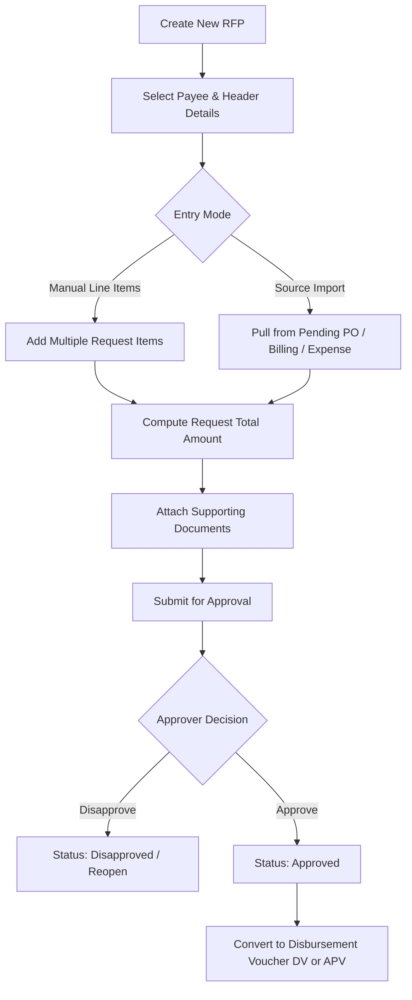

# Request for Payment Module Architecture & Implementation Specification

> **Module**: Request for Payment (`RFP`)  
> **Domain**: Cash Disbursement (`cash-disbursement`)  
> **Route Base**: `/cash-disbursement/request-for-payment`  
> **Standards Compliance**: [`FRONTEND_MAP.md`](file:///d:/FILES/PROGRAMS/Gr8BooksNeo/gr8bookslite-frontend/FRONTEND_MAP.md), [`QA_ANALYSIS_GUIDE.md`](file:///d:/FILES/PROGRAMS/Gr8BooksNeo/gr8bookslite-frontend/QA_ANALYSIS_GUIDE.md), and [`AGENTS.md`](file:///d:/FILES/PROGRAMS/Gr8BooksNeo/gr8bookslite-frontend/AGENTS.md)

---

## 1. Executive Summary & Multi-Request Processing Overview

The **Request for Payment (RFP)** module under `cash-disbursement` serves as a non-accounting requisition and approval document for internal disbursements. Because this is a requisition document, **it does not generate or contain accounting journal entries (debits/credits)**. Accounting entries are handled subsequently upon conversion into a **Disbursement Voucher (`DV`)** or **Accounts Payable Voucher (`APV`)**.

The module enables users to:
1. Aggregate multiple payment requests, vendor invoices, or expense claims into a single structured authorization request.
2. Itemize multiple request line items with individual source references (PO, Billing, Expense, Contract, Manual), cost center tags, and individual amounts.
3. Attach supporting receipts, signed invoices, and quotations for audit and compliance.
4. Seamlessly route approved RFPs for forward conversion into **Disbursement Vouchers (`DV`)** or **Accounts Payable Vouchers (`APV`)**.

```
+-------------------------------------------------------------------------------------------------------------------------+
| [Section 1] Request for Payment Header Information                                                                      |
|   [Column 1: Payee & Terms]          [Column 2: Dates, Bank & Method]            [Column 3: Document Details]           |
|   Payee / Party: * [ AppAdvancedDropdown ] Document Date: * [ 08/18/2026 ]        RFP No:                 [ RFP-000001 ] |
|   TIN:             [ 123-456-789-000 ] Date Needed:   * [ 08/25/2026 ]           Status:                 [ Draft ]      |
|   Address:         [ Makati City... ] Payment Method:   [ Bank Transfer v ]      Total Amount:           [ 125,000.00 ] |
|   Cost Center:     [ Operations v ]   Bank Master:      [ BDO - 001150002717 v ]                                        |
|   Remarks:         [ Textarea... ]                                                                                      |
+-------------------------------------------------------------------------------------------------------------------------+
| [Section 2] Multi-Request Processing & Line Items Management                                                            |
|   [Tab 1: Request Items (3)]                      [Tab 2: Supporting Documents / Attachments (2)]                       |
|   -------------------------------------------------------------------------------------------------------------------   |
|   [+ Add Request Item]   [Import from PO / Billing]                                      [Search Line Items...]         |
|   +----+-------------+--------------+-------------------------------+---------------------+---------------------------+ |
|   | #  | Ref Type    | Ref Number   | Particulars / Description     | Cost Center         | Amount                    | |
|   +----+-------------+--------------+-------------------------------+---------------------+---------------------------+ |
|   | 1  | PO          | PO-2026-0089 | Hardware equipment batch 1    | IT Infrastructure   |                 75,000.00 | |
|   | 2  | Billing     | BIL-99402    | Data center colocation fee    | IT Infrastructure   |                 35,000.00 | |
|   | 3  | Expense     | EXP-10492    | Cabling and onsite setup      | General Operations  |                 15,000.00 | |
|   +----+-------------+--------------+-------------------------------+---------------------+---------------------------+ |
|   Total Request Items: 3                                                         Grand Total:            125,000.00   |
+-------------------------------------------------------------------------------------------------------------------------+
```

---

## 2. Multi-Request Processing Workflow



### Multi-Item Processing Rules:
1. **Dynamic Item Grid**: Users can append multiple payment item lines representing different expenses, vendor bills, or department requisitions.
2. **Auto-Summation**: The header `Total Amount` automatically reflects the exact sum of all line item amounts ($\sum \text{Item Amounts}$).
3. **Validation Check**: Prevents saving if no request items are added, or if any line item has zero or negative amounts.

---

## 3. Comprehensive Field & Section Specifications

### Section 1: Header Information (3-Column Layout)

#### Column 1: Payee Information & Cost Center
| Field Label | Property Name | Type | Component | Required | Behavior / Notes |
| :--- | :--- | :--- | :--- | :---: | :--- |
| **Payee / Party: \*** | `partyCode` / `partyName` | `string` | [`AppAdvancedDropdown`](file:///d:/FILES/PROGRAMS/Gr8BooksNeo/gr8bookslite-frontend/app/src/ui/shared/advanced-dropdown/AppAdvancedDropdown.tsx) | **Yes** | Searchable party dropdown sourcing vendors, contractors, and employees from `party-management`. Auto-populates TIN, Address, and Contact details. |
| **TIN:** | `partyTin` | `string` | Readonly `TextField` | No | Vendor/Payee Tax Identification Number. |
| **Address:** | `partyAddress` | `string` | Readonly `TextField` | No | Registered business or billing address. |
| **Cost Center:** | `costCenter` / `responsibilityCenter` | `string` | Dropdown / Select | No | Default cost center or department charged with this payment request. |
| **Remarks:** | `remarks` | `string` | `AppLimitedTextarea` | No | General payment purpose, project references, or notes (max 500 characters). |

#### Column 2: Dates, Bank & Payment Method
| Field Label | Property Name | Type | Component | Required | Behavior / Notes |
| :--- | :--- | :--- | :--- | :---: | :--- |
| **Document Date: \*** | `documentDate` | `string` | Date Picker (`type="date"`) | **Yes** | Date when the payment request is created (defaults to current date). |
| **Date Needed: \*** | `dateNeeded` | `string` | Date Picker (`type="date"`) | **Yes** | Deadline by when the payment check or fund transfer must be released. |
| **Payment Method:** | `paymentMethod` | `enum` | Dropdown (`Check`, `Cash`, `Bank Transfer`, `Online`) | **Yes** | Method of disbursement. |
| **Bank Account:** | `bankId` / `bankAccountNo` | `string` | Dropdown / `AppAdvancedDropdown` | Conditional | Sourced from `bank-masterfile` (used when payment method requires specific issuing bank). |

#### Column 3: Document Reference & Status
| Field Label | Property Name | Type | Component | Required | Behavior / Notes |
| :--- | :--- | :--- | :--- | :---: | :--- |
| **RFP No:** | `rfpNo` / `transNo` | `string` | Readonly `TextField` | **Yes** | System auto-generated serial code (e.g., `RFP-2026-0001`). |
| **Status:** | `status` | `enum` | Readonly `TextField` / Badge | **Yes** | Lifecycle states: `Draft`, `For Approval`, `Approved`, `Disapproved`, `Cancelled`, `Closed`. |
| **Total Amount:** | `totalAmount` | `number` | Readonly `TextField` | **Yes** | Formatted currency display computed from line items: $\sum \text{Item Amounts}$. |

---

### Section 2: Multi-Request Processing Tabs

#### Tab 1: Request Particulars / Line Items
Contains a multi-row data grid for processing multiple payment line requests:
- **Columns**:
  1. `[#]` — Row index.
  2. `Ref Type` — Source document type (`PO`, `Billing`, `Expense`, `Contract`, `Manual`).
  3. `Ref Number` — Document tracking reference code (e.g., `PO-2026-0089`).
  4. `Particulars` — Detailed description of the requested payment or expense item.
  5. `Cost Center` — Allocated responsibility center.
  6. `Amount` — Numeric amount formatted to 2 decimal places.
  7. `Actions` — Row actions (`Delete Row`, `Duplicate Row`).
- **Toolbar**: `Add Request Item` button, `Import Pending POs` drawer trigger, `Clear Grid`.

#### Tab 2: Supporting Documents & Attachments
File upload interface for audit trail and compliance:
- Dropzone supporting `.pdf`, `.jpg`, `.png`, `.xlsx`, `.docx` up to 10MB per file.
- Attachment list with file preview, download, and delete actions.

---

## 4. Frontend File & Layer Structure

In strict alignment with [`FRONTEND_MAP.md`](file:///d:/FILES/PROGRAMS/Gr8BooksNeo/gr8bookslite-frontend/FRONTEND_MAP.md) and [`QA_ANALYSIS_GUIDE.md`](file:///d:/FILES/PROGRAMS/Gr8BooksNeo/gr8bookslite-frontend/QA_ANALYSIS_GUIDE.md):

```
gr8bookslite-frontend/
├── app/
│   └── (modules)/
│       └── cash-disbursement/
│           └── request-for-payment/
│               ├── page.tsx                    # List route -> <RequestForPaymentListPage />
│               ├── add/
│               │   └── page.tsx                # Add route -> <RequestForPaymentFormPage />
│               ├── edit/
│               │   └── [recordId]/
│               │       └── page.tsx            # Edit route -> <RequestForPaymentFormPage />
│               └── view/
│                   └── [recordId]/
│                       └── page.tsx            # View route -> <RequestForPaymentFormPage />
│
└── app/src/
    ├── types/modules/cash-disbursement/request-for-payment/
    │   └── RequestForPaymentTypes.ts           # Domain models, item lines, form values, filters
    │
    ├── constants/modules/cash-disbursement/request-for-payment/
    │   └── RequestForPaymentConstants.ts       # Storage keys, routes, columns, status mappings
    │
    ├── validations/modules/cash-disbursement/request-for-payment/
    │   └── RequestForPaymentValidation.ts      # Zod validation schema for header and multi-items
    │
    ├── data/modules/cash-disbursement/request-for-payment/
    │   └── RequestForPaymentData.ts            # Totals calculator, initial states, formatters
    │
    ├── services/modules/cash-disbursement/request-for-payment/
    │   ├── RequestForPaymentQueryKeys.ts       # Query keys scoped to ["cash-disbursement", "request-for-payment"]
    │   └── RequestForPaymentApi.ts             # API client calls (list, get, create, update, delete, status, convert)
    │
    ├── hooks/modules/cash-disbursement/request-for-payment/
    │   ├── useRequestForPayment.ts             # React Query hooks (queries & mutations)
    │   ├── useRequestForPaymentListPage.ts     # List filtering, TanStack table, pagination
    │   └── useRequestForPaymentFormPage.ts     # Multi-item state, party selection, calculations
    │
    └── ui/modules/cash-disbursement/request-for-payment/
        ├── RequestForPaymentListPage.tsx       # Main list page with KPI cards and table
        ├── RequestForPaymentFormPage.tsx       # 3-Column header and tab orchestrator
        ├── RequestForPaymentItemsTable.tsx     # Multi-request line item editable grid
        ├── RequestForPaymentAttachments.tsx    # Supporting document drag & drop uploader
        ├── RequestForPaymentTableRow.tsx       # Table row component with status badges
        ├── RequestForPaymentRecordActions.tsx  # Row actions (View, Edit, Approve, Convert to DV)
        ├── RequestForPaymentStatisticCards.tsx # Summary KPI cards
        └── RequestForPaymentNotFound.tsx       # 404 / Missing record fallback
```

---

## 5. TypeScript Domain Types Definition

```typescript
export type RequestForPaymentStatus =
  | "Draft"
  | "For Approval"
  | "Approved"
  | "Disapproved"
  | "Cancelled"
  | "Closed";

export type PaymentMethod = "Check" | "Cash" | "Bank Transfer" | "Online";

export type RequestForPaymentItem = {
  id: string;
  refType: "PO" | "Billing" | "Expense" | "Contract" | "Manual";
  refNumber: string;
  particulars: string;
  costCenter: string;
  amount: number;
};

export type RequestForPaymentAttachment = {
  id: string;
  fileName: string;
  fileSize: number;
  fileUrl: string;
  uploadedAt: string;
};

export type RequestForPaymentFormValues = {
  rfpNo: string;
  documentDate: string;
  dateNeeded: string;
  partyCode: string;
  partyName: string;
  partyTin?: string;
  partyAddress?: string;
  paymentMethod: PaymentMethod;
  bankId?: string;
  bankAccountNo?: string;
  costCenter: string;
  remarks: string;
  status: RequestForPaymentStatus;
  items: RequestForPaymentItem[];
  attachments: RequestForPaymentAttachment[];
};

export type RequestForPaymentRecord = {
  id: string;
  rfpNo: string;
  documentDate: string;
  dateNeeded: string;
  partyCode: string;
  partyName: string;
  paymentMethod: PaymentMethod;
  costCenter: string;
  totalAmount: number;
  status: RequestForPaymentStatus;
  remarks?: string;
  formValues?: RequestForPaymentFormValues;
  createdAt: string;
  createdBy?: string;
  updatedAt: string;
  updatedBy?: string;
};
```

---

## 6. Table Preferences & Module Key

- **Storage Key**: `gr8booksneo:request-for-payment:table-preferences`
- **Backend Table Preferences Module Key**: `cash-disbursement:request-for-payment` *(Uses colon `:` to satisfy backend validation regex `/^[a-z0-9][a-z0-9:-]{0,119}$/`)*
- **Query Keys**: Scoped to `["cash-disbursement", "request-for-payment"]`.

---

## 7. Quality Assurance Checklist

- [x] **Requisition Focus**: Non-accounting module — zero accounting entries or debit/credit grids.
- [x] **No Direct Fetch**: All requests routed through `RequestForPaymentApi.ts` and TanStack Query hooks.
- [x] **No Legacy Wrappers**: No `Main.tsx`, `Action.tsx`, or `index.ts`.
- [x] **Multi-Item Integrity**: Line item amounts strictly sum to total amount; validates non-empty lines with positive amounts.
- [x] **Advanced Dropdown Integration**: Party / Payee selection uses [`AppAdvancedDropdown`](file:///d:/FILES/PROGRAMS/Gr8BooksNeo/gr8bookslite-frontend/app/src/ui/shared/advanced-dropdown/AppAdvancedDropdown.tsx).
- [x] **Zero TypeScript & ESLint Errors**: Strict compliance with codebase linting rules and Prettier configuration.
