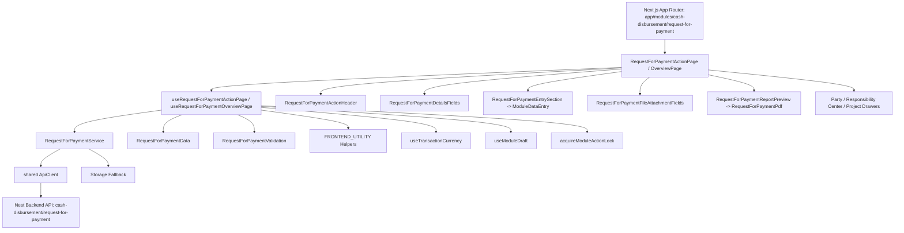
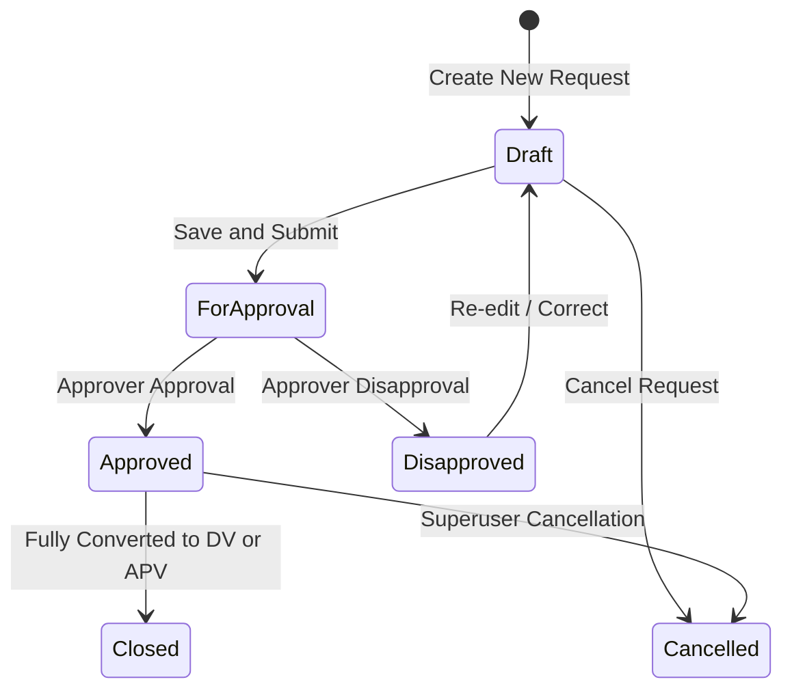

# Request for Payment Module Architecture & Implementation Specification

> **Module**: Request for Payment (`RFP`)  
> **Domain**: Cash Disbursement (`cash-disbursement`)  
> **Route Base**: `/cash-disbursement/request-for-payment`  
> **Standards Compliance**: [`FRONTEND_MAP.md`](file:///d:/FILES/PROGRAMS/Gr8BooksNeo/gr8bookslite-frontend/FRONTEND_MAP.md), [`FRONTEND_TRANSACTION_MAP.md`](file:///d:/FILES/PROGRAMS/Gr8BooksNeo/gr8bookslite-frontend/FRONTEND_TRANSACTION_MAP.md), [`FRONTEND_UTILITY.md`](file:///d:/FILES/PROGRAMS/Gr8BooksNeo/gr8bookslite-frontend/FRONTEND_UTILITY.md), [`QA_ANALYSIS_GUIDE.md`](file:///d:/FILES/PROGRAMS/Gr8BooksNeo/gr8bookslite-frontend/QA_ANALYSIS_GUIDE.md), and [`AGENTS.md`](file:///d:/FILES/PROGRAMS/Gr8BooksNeo/gr8bookslite-frontend/AGENTS.md)  
> **Reference Implementation Pattern**: [`petty-cash-fund`](file:///d:/FILES/PROGRAMS/Gr8BooksNeo/gr8bookslite-frontend/app/src/ui/modules/cash-disbursement/petty-cash-fund)

---

## 1. Executive Summary & Multi-Request Processing Overview

The **Request for Payment (RFP)** module under `cash-disbursement` serves as a non-accounting requisition and approval document for internal disbursements and vendor payment requests. Because this is a requisition document, **it does not generate or contain accounting journal entries (debits/credits)**. Accounting entries are recorded subsequently upon conversion into a **Disbursement Voucher (`DV`)** or **Accounts Payable Voucher (`APV`)**.

This document establishes the architecture and complete implementation blueprint for the RFP module, designed to strictly mirror the transactional architecture established by **Petty Cash Fund (`petty-cash-fund`)** and the canonical guidelines in `FRONTEND_MAP.md`, `FRONTEND_TRANSACTION_MAP.md`, and `FRONTEND_UTILITY.md`.

### Core Capabilities
1. **Multi-Item Request Grid**: Itemizes multiple payment line requests with source references (PO, Billing, Expense, Contract, Manual), particulars, cost center tags, and individual line amounts.
2. **Auto-Summation**: Real-time computation of `totalAmount` based on line item sums ($\sum \text{Line Amounts}$).
3. **Multi-Mode Action Interface**: Unified action page supporting `add`, `edit`, and `view` modes with tabbed sections (`details` and `attachments`).
4. **Copy-From Sourcing**: Allows populating request lines directly from pending Purchase Orders (`PO`), Billing Statements, or Expense Claims.
5. **Print & PDF Generation**: Integrated PDF export and preview dialog powered by `pdfmake`.
6. **Conversion Readiness**: Forward conversion workflow to Disbursement Vouchers (`DV`) or Accounts Payable Vouchers (`APV`) once status reaches `Approved`.

---

## 2. Visual Wireframe Layout

```
+-------------------------------------------------------------------------------------------------------------------------+
| [Section 1] Request for Payment Header Information                                                                      |
|   [Column 1: Payee & Responsibility] [Column 2: Dates, Bank & Method]            [Column 3: Document Details]           |
|   Payee / Party: * [ AppAdvancedDropdown ] Document Date: * [ 08/18/2026 ]        RFP No:                 [ RFP-000001 ] |
|   TIN:             [ 123-456-789-000 ] Date Needed:   * [ 08/25/2026 ]           Status:                 [ Draft ]      |
|   Address:         [ Makati City... ] Payment Method:   [ Bank Transfer v ]      Total Amount:           [ 125,000.00 ] |
|   Responsibility:  [ Operations v ]   Bank Master:      [ BDO - 001150002717 v ] Currency / FX:          [ PHP @ 1.00 ] |
|   Project:         [ Main Office v ]                                                                                    |
|   Remarks:         [ AppLimitedTextarea... (max 500 chars) ]                                                            |
+-------------------------------------------------------------------------------------------------------------------------+
| [Section 2] Tabbed Action Sections                                                                                      |
|   [Tab 1: Request Details]                        [Tab 2: File Attachments (2)]                                         |
|   -------------------------------------------------------------------------------------------------------------------   |
|   [+ Add Row]   [Copy From PO / Billing]   [Columns v]                                    [Search Line Items...]        |
|   +----+------------+--------------+-------------------------------+---------------------+----------------------------+ |
|   | #  | Date       | Ref Type     | Ref Number / Particulars      | Responsibility Ctr  | Amount                     | |
|   +----+------------+--------------+-------------------------------+---------------------+----------------------------+ |
|   | 1  | 08/18/2026 | PO           | PO-2026-0089 - IT Equipment   | RC-OPS - Operations |                  75,000.00 | |
|   | 2  | 08/18/2026 | Billing      | BIL-99402 - Cloud Hosting     | RC-IT  - Technology |                  35,000.00 | |
|   | 3  | 08/18/2026 | Expense      | EXP-10492 - Office Repairs    | RC-ADM - Admin      |                  15,000.00 | |
|   +----+------------+--------------+-------------------------------+---------------------+----------------------------+ |
|   Total Items: 3                                                                  Grand Total:             125,000.00   |
+-------------------------------------------------------------------------------------------------------------------------+
```

---

## 3. Transaction Runtime & Data Flow Graph



### Requisition Lifecycle State Machine



---

## 4. Frontend File & Layer Structure

Following the modern transaction pattern (`action/`, `entries/`, `overview/`, `reports/`) used in `cash-disbursement/petty-cash-fund` and specified in `FRONTEND_TRANSACTION_MAP.md`:

```txt
gr8bookslite-frontend/
├── app/
│   └── (modules)/
│       └── cash-disbursement/
│           └── request-for-payment/
│               ├── page.tsx                                # Overview route -> <RequestForPaymentOverviewPage />
│               ├── add/
│               │   └── page.tsx                            # Add route -> <RequestForPaymentActionPage mode="add" />
│               ├── edit/
│               │   └── [recordId]/
│               │       └── page.tsx                        # Edit route -> <RequestForPaymentActionPage mode="edit" />
│               └── view/
│                   └── [recordId]/
│                       └── page.tsx                        # View route -> <RequestForPaymentActionPage mode="view" />
│
└── app/src/
    ├── constants/modules/cash-disbursement/request-for-payment/
    │   └── RequestForPaymentConstants.ts                   # Route links, storage keys, columns, status options, dropdown options
    │
    ├── data/modules/cash-disbursement/request-for-payment/
    │   └── RequestForPaymentData.ts                        # Seed data, copy-from records, blank item factory, form initializers, totals
    │
    ├── types/modules/cash-disbursement/request-for-payment/
    │   └── RequestForPaymentTypes.ts                       # Domain types, form values, items, state types, status enums
    │
    ├── validations/modules/cash-disbursement/request-for-payment/
    │   └── RequestForPaymentValidation.ts                  # Zod validation schema and form validator function
    │
    ├── services/modules/cash-disbursement/request-for-payment/
    │   └── RequestForPaymentService.ts                     # CRUD operations, query keys, sequence generator, API client integration
    │
    ├── hooks/modules/cash-disbursement/request-for-payment/
    │   ├── useRequestForPaymentActionPage.ts               # Action page orchestration, draft autosave, currency, item management
    │   └── useRequestForPaymentOverviewPage.ts             # Table state, filtering (DateRange, AmountRange), search, statistics
    │
    └── ui/modules/cash-disbursement/request-for-payment/
        ├── action/
        │   ├── RequestForPaymentActionPage.tsx             # Action orchestrator with drawers, header, tabs, and print preview
        │   ├── RequestForPaymentActionHeader.tsx           # Title, back button, status badge, action buttons, dialogs
        │   ├── RequestForPaymentDetailsFields.tsx          # 3-column responsive header form fields
        │   ├── RequestForPaymentFileAttachmentFields.tsx   # TransactionAttachmentDropzone file upload section
        │   ├── RequestForPaymentStatusActions.tsx          # Contextual action buttons per status (Save, Draft, Approve, etc.)
        │   ├── RequestForPaymentActionHistory.tsx          # Audit trail and timestamps footer
        │   └── RequestForPaymentNotFound.tsx               # 404 / Missing record fallback card
        │
        ├── entries/
        │   ├── RequestForPaymentEntrySection.tsx           # Entry section wrapper
        │   ├── RequestForPaymentDetailEntryTable.tsx       # ModuleDataEntry multi-item grid with columns, chooser & totals
        │   └── RequestForPaymentEntryColumns.tsx           # Column configurations (inputs, dropdowns, formatters)
        │
        ├── overview/
        │   ├── RequestForPaymentOverviewPage.tsx           # Overview page with KPI cards, toolbar, ModuleTable, pagination
        │   ├── RequestForPaymentTableToolbar.tsx           # Search, status filter, DateRangePicker, AmountRangePicker, spotlight
        │   ├── RequestForPaymentTableCell.tsx              # Custom table cell renderers (badges, links, formatted currency)
        │   └── RequestForPaymentRecordActions.tsx          # Row actions menu (View, Edit, Approve, Disapprove, Cancel, Convert)
        │
        └── reports/
            ├── RequestForPaymentPdf.ts                     # pdfmake document definition and print/open handler
            └── RequestForPaymentReportPreview.tsx          # Fullscreen PDF preview modal dialog
```

---

## 5. TypeScript Domain Types Specification

File: `app/src/types/modules/cash-disbursement/request-for-payment/RequestForPaymentTypes.ts`

```typescript
import type { TransactionAttachment } from "@/app/src/types/shared/transaction-setup/TransactionAttachmentTypes";
import type { useRequestForPaymentActionPage } from "@/app/src/hooks/modules/cash-disbursement/request-for-payment/useRequestForPaymentActionPage";
import type { useRequestForPaymentOverviewPage } from "@/app/src/hooks/modules/cash-disbursement/request-for-payment/useRequestForPaymentOverviewPage";

export type RequestForPaymentStatus =
  | "Draft"
  | "For Approval"
  | "Approved"
  | "Disapproved"
  | "Cancelled"
  | "Closed";

export type RequestForPaymentFormStatus = "Open" | RequestForPaymentStatus;
export type RequestForPaymentActionMode = "add" | "edit" | "view";
export type RequestForPaymentActionTab = "details" | "attachments";
export type RequestForPaymentConfirmationAction =
  | "save"
  | "draft"
  | "approve"
  | "disapprove"
  | "cancel";

export type RequestForPaymentActionPageState = ReturnType<typeof useRequestForPaymentActionPage>;
export type RequestForPaymentOverviewPageState = ReturnType<typeof useRequestForPaymentOverviewPage>;

export type RequestForPaymentRefType = "PO" | "Billing" | "Expense" | "Contract" | "Manual";
export type RequestForPaymentPaymentMethod = "Check" | "Cash" | "Bank Transfer" | "Online";

export type RequestForPaymentItem = {
  id: string;
  date: string;
  refType: RequestForPaymentRefType;
  refNumber: string;
  particulars: string;
  responsibilityCenterCode: string;
  responsibilityCenterName: string;
  amount: string;
  remarks?: string;
};

export type RequestForPaymentItemColumnId = Exclude<keyof RequestForPaymentItem, "id" | "remarks">;

export type RequestForPaymentFormValues = {
  transactionNo: string;
  documentDate: string;
  dateNeeded: string;
  status: RequestForPaymentFormStatus;
  partyCode: string;
  partyName: string;
  partyTin?: string;
  partyAddress?: string;
  paymentMethod: RequestForPaymentPaymentMethod;
  bankId?: string;
  bankAccountNo?: string;
  bankName?: string;
  responsibilityCenterCode: string;
  responsibilityCenterName: string;
  projectCode: string;
  projectName: string;
  currency: string;
  exchangeRate: string;
  remarks: string;
  items: RequestForPaymentItem[];
  attachments: TransactionAttachment[];
};

export type RequestForPaymentRecord = {
  id: string;
  transactionNo: string;
  documentDate: string;
  dateNeeded: string;
  partyCode: string;
  partyName: string;
  paymentMethod: RequestForPaymentPaymentMethod;
  responsibilityCenterCode: string;
  responsibilityCenterName: string;
  amount: number;
  currency: string;
  remarks: string;
  status: RequestForPaymentStatus;
  convertedTo?: "DV" | "APV";
  convertedRefNo?: string;
  createdBy: string;
  createdAt: string;
  updatedBy: string;
  updatedAt: string;
  formValues?: RequestForPaymentFormValues;
};

export type RequestForPaymentFormErrors = Partial<Record<keyof RequestForPaymentFormValues | "items", string>>;
export type RequestForPaymentUpdateStatusHandler = (
  record: RequestForPaymentRecord,
  status: RequestForPaymentStatus
) => void;
```

---

## 6. Constants & Configuration Specifications

File: `app/src/constants/modules/cash-disbursement/request-for-payment/RequestForPaymentConstants.ts`

```typescript
import { getModuleRoute } from "@/app/src/data/shared/modules/ModuleCatalogData";
import type {
  RequestForPaymentActionTab,
  RequestForPaymentConfirmationAction,
  RequestForPaymentItemColumnId,
  RequestForPaymentStatus,
} from "@/app/src/types/modules/cash-disbursement/request-for-payment/RequestForPaymentTypes";
import type { AppAdvancedDropdownOption } from "@/app/src/types/shared/advanced-dropdown/AppAdvancedDropdownTypes";

// Route Links via Module Catalog
export const RequestForPaymentLink = getModuleRoute("RFP");
export const RequestForPaymentAddLink = `${RequestForPaymentLink}/add`;
export const getRequestForPaymentEditLink = (recordId: string) => `${RequestForPaymentLink}/edit/${recordId}`;
export const getRequestForPaymentViewLink = (recordId: string) => `${RequestForPaymentLink}/view/${recordId}`;

// Storage & Module Keys
export const RequestForPaymentStorageKey = "cash-disbursement-request-for-payment-records";
export const RequestForPaymentPaginationStorageKey = "cash-disbursement-request-for-payment-table";
export const RequestForPaymentTransactionPrefix = "RFP";
export const RequestForPaymentBackendModuleKey = "cash-disbursement:request-for-payment";

// Copy From Source Types
export const RequestForPaymentCopyFromSources = ["Purchase Order", "Billing Invoice", "Expense Claim"] as const;

// Overview Table Columns Configuration
export const RequestForPaymentColumnLabels = {
  transactionNo: "RFP No.",
  documentDate: "Document Date",
  dateNeeded: "Date Needed",
  partyCode: "Payee Code",
  partyName: "Payee Name",
  paymentMethod: "Payment Method",
  responsibilityCenterName: "Responsibility Center",
  amount: "Total Amount",
  remarks: "Remarks",
  createdBy: "Created By",
  createdAt: "Date Created",
  updatedBy: "Updated By",
  updatedAt: "Date Modified",
  status: "Status",
  actions: "Actions",
} as const;

export const RequestForPaymentDefaultVisibleColumnIds = [
  "transactionNo",
  "documentDate",
  "dateNeeded",
  "partyName",
  "paymentMethod",
  "amount",
  "status",
  "actions",
] as const;

export const RequestForPaymentDefaultColumnVisibility = Object.fromEntries(
  Object.keys(RequestForPaymentColumnLabels).map((columnId) => [
    columnId,
    RequestForPaymentDefaultVisibleColumnIds.includes(
      columnId as (typeof RequestForPaymentDefaultVisibleColumnIds)[number]
    ),
  ])
);

// Statuses & Confirmation Labels
export const RequestForPaymentStatuses = {
  cancelled: "Cancelled",
  closed: "Closed",
  disapproved: "Disapproved",
  draft: "Draft",
  forApproval: "For Approval",
  open: "Open",
  approved: "Approved",
} as const;

export const RequestForPaymentRecordStatuses = [
  "Approved",
  "For Approval",
  "Draft",
  "Disapproved",
  "Cancelled",
  "Closed",
] as const satisfies readonly RequestForPaymentStatus[];

export const RequestForPaymentStatusOptions = ["All", ...RequestForPaymentRecordStatuses] as const;

export const RequestForPaymentActionTabs: { id: RequestForPaymentActionTab; label: string }[] = [
  { id: "details", label: "Request Details" },
  { id: "attachments", label: "File Attachments" },
];

export const RequestForPaymentConfirmationDialogTitles: Record<RequestForPaymentConfirmationAction, string> = {
  save: "Save Request for Payment?",
  draft: "Save Request for Payment as Draft?",
  approve: "Approve Request for Payment?",
  disapprove: "Disapprove Request for Payment?",
  cancel: "Cancel Request for Payment?",
};

export const RequestForPaymentConfirmationDialogConfirmLabels: Record<RequestForPaymentConfirmationAction, string> = {
  save: "Save and Submit",
  draft: "Save as Draft",
  approve: "Approve",
  disapprove: "Disapprove",
  cancel: "Cancel",
};

// Item Grid Columns Configuration
export const RequestForPaymentDefaultItemColumnIds: RequestForPaymentItemColumnId[] = [
  "date",
  "refType",
  "refNumber",
  "particulars",
  "responsibilityCenterName",
  "amount",
];

export const RequestForPaymentDefaultVisibleItemColumnIds: RequestForPaymentItemColumnId[] = [
  "date",
  "refType",
  "refNumber",
  "particulars",
  "amount",
];

export const RequestForPaymentItemColumnLabels: Record<RequestForPaymentItemColumnId, string> = {
  date: "Date",
  refType: "Ref Type",
  refNumber: "Ref Number",
  particulars: "Particulars",
  responsibilityCenterCode: "RC Code",
  responsibilityCenterName: "Responsibility Center",
  amount: "Amount",
};

export const RequestForPaymentItemColumnWidths: Record<RequestForPaymentItemColumnId, number> = {
  date: 140,
  refType: 140,
  refNumber: 170,
  particulars: 260,
  responsibilityCenterCode: 150,
  responsibilityCenterName: 200,
  amount: 180,
};

export const RequestForPaymentProtectedItemColumnIds = new Set<RequestForPaymentItemColumnId>(["particulars", "amount"]);

// Dropdown Lookup Options
export const RequestForPaymentPaymentMethodOptions: AppAdvancedDropdownOption[] = [
  { label: "Check", name: "Check", value: "Check" },
  { label: "Cash", name: "Cash", value: "Cash" },
  { label: "Bank Transfer", name: "Bank Transfer", value: "Bank Transfer" },
  { label: "Online", name: "Online", value: "Online" },
];

export const RequestForPaymentRefTypeOptions: AppAdvancedDropdownOption[] = [
  { label: "PO", name: "Purchase Order", value: "PO" },
  { label: "Billing", name: "Billing Invoice", value: "Billing" },
  { label: "Expense", name: "Expense Claim", value: "Expense" },
  { label: "Contract", name: "Contract / Agreement", value: "Contract" },
  { label: "Manual", name: "Manual Request", value: "Manual" },
];

export function canEditRequestForPayment(status: RequestForPaymentStatus): boolean {
  return (
    status === RequestForPaymentStatuses.draft ||
    status === RequestForPaymentStatuses.forApproval ||
    status === RequestForPaymentStatuses.disapproved
  );
}
```

---

## 7. Data Layer & Mappers Specification

File: `app/src/data/modules/cash-disbursement/request-for-payment/RequestForPaymentData.ts`

### Utility & Standards Compliance Rules:
1. **Never create local formatters**: Always import pure formatters from `FRONTEND_UTILITY.md`:
   - `formatCurrency`, `formatAmount` from `@/app/src/utils/currency.util`
   - `formatDate`, `todayDateValue`, `parseIsoDate` from `@/app/src/utils/date.util`
   - `normalizeWhitespace`, `cleanOptional` from `@/app/src/utils/string.util`
   - `parseAmount` from `@/app/src/utils/number.util`
   - `formatPartOfTotalPercentage` from `@/app/src/utils/percentage.util`
   - `formatFileSize` from `@/app/src/utils/file.util`

### Key Functions
- `createBlankRequestForPaymentItem()`: Generates a blank item row with a unique UUID/timestamp key, current date, default refType (`Manual`), and empty amount.
- `createRequestForPaymentFormValues(record?, transactionNo, baseCurrencyCode)`: Initializes form state for `add`, `edit`, or `view` modes with safe defaults.
- `calculateRequestForPaymentTotals(items)`: Pure reducer summing all valid item amounts into a single scalar number.
- `createRequestForPaymentRecord(values, status, existing?)`: Maps form state to persisted record shape with audit timestamps (`createdAt`, `updatedAt`, `createdBy`, `updatedBy`).

---

## 8. Validation Layer Specification (Zod)

File: `app/src/validations/modules/cash-disbursement/request-for-payment/RequestForPaymentValidation.ts`

```typescript
import { z } from "zod";
import type {
  RequestForPaymentFormErrors,
  RequestForPaymentFormValues,
} from "@/app/src/types/modules/cash-disbursement/request-for-payment/RequestForPaymentTypes";
import { parseAmount } from "@/app/src/utils/number.util";

const schema = z.object({
  transactionNo: z.string().regex(/^RFP-\d{6}$/, "A valid RFP No. is required."),
  documentDate: z.string().min(1, "Select an RFP Date."),
  dateNeeded: z.string().min(1, "Select Date Needed."),
  partyCode: z.string().trim().min(1, "Select a Payee."),
  partyName: z.string().trim().min(1, "Select a Payee."),
  paymentMethod: z.enum(["Check", "Cash", "Bank Transfer", "Online"], {
    errorMap: () => ({ message: "Select a payment method." }),
  }),
});

export function validateRequestForPaymentForm(values: RequestForPaymentFormValues): RequestForPaymentFormErrors {
  const errors: RequestForPaymentFormErrors = {};
  const result = schema.safeParse(values);

  if (!result.success) {
    for (const issue of result.error.issues) {
      errors[issue.path[0] as keyof RequestForPaymentFormValues] ??= issue.message;
    }
  }

  // Cross-field date check
  if (values.documentDate && values.dateNeeded && values.dateNeeded < values.documentDate) {
    errors.dateNeeded = "Date Needed cannot be earlier than Document Date.";
  }

  // Line items validation
  if (values.items.length === 0 || values.items.every((item) => !item.particulars.trim() && (parseAmount(item.amount) ?? 0) <= 0)) {
    errors.items = "Add at least one payment request item.";
  } else if (values.items.some((item) => !item.particulars.trim() || (parseAmount(item.amount) ?? 0) <= 0)) {
    errors.items = "Each item needs particulars and an amount greater than zero.";
  }

  return errors;
}
```

---

## 9. Services Layer Specification

File: `app/src/services/modules/cash-disbursement/request-for-payment/RequestForPaymentService.ts`

- **Query Keys**: `["cash-disbursement", "request-for-payment"]`
- **CRUD Operations**:
  - `getRequestForPaymentRecords()`: Reads records from localStorage with fallback to `RequestForPaymentSeedRecords`.
  - `getRequestForPaymentRecordById(id)`: Fetches a single record by its UUID.
  - `upsertRequestForPaymentRecord(record)`: Updates or adds a record and triggers cache sync.
  - `deleteRequestForPaymentRecord(id)`: Removes a record from the collection.
  - `updateRequestForPaymentStatus(id, status)`: Transitions status (`Approved`, `Disapproved`, `Cancelled`, `Closed`).
  - `createNextRequestForPaymentNumber()`: Inspects existing sequence and generates `RFP-00000X`.
  - `convertRequestForPaymentToDisbursementVoucher(id)`: Generates a pre-filled Disbursement Voucher payload and links `convertedTo: "DV"`.

---

## 10. Custom Hooks Specification

### 1. `useRequestForPaymentActionPage.ts`
Manages the complete lifecycle of the Action Screen:
- Reads route mode (`add`, `edit`, `view`) and loads the record.
- Integrates `useTransactionCurrency` for live currency codes and FX rates.
- Manages draft auto-saving via `useModuleDraft` with key `createModuleDraftKey({ mode, moduleId: "cash-disbursement:request-for-payment", recordId })`.
- Handles submit locking via `acquireModuleActionLock` to prevent double submissions.
- Provides item operations: `addItem`, `updateItem`, `removeItem`, `reorderItems`.
- Calculates real-time totals with `useMemo(() => calculateRequestForPaymentTotals(values.items), [values.items])`.
- Handles status transitions (`handleSave`, `handleSaveAsDraft`, `handleApprove`, `handleDisapprove`, `handleCancel`).

### 2. `useRequestForPaymentOverviewPage.ts`
Manages the list overview and TanStack table state:
- Table state with `useReactTable`, sorting, and pagination.
- Multi-dimensional filtering:
  - Text search query (`transactionNo`, `partyCode`, `partyName`, `particulars`, `remarks`).
  - Status filter pill (`All`, `Approved`, `For Approval`, `Draft`, `Disapproved`, `Cancelled`).
  - Date range filtering via `DateRangeValue` (`from`, `to`).
  - Amount range filtering via `AmountRangeValue` (`from`, `to`).
- Column visibility state synced with `RequestForPaymentDefaultColumnVisibility`.
- Metric statistic cards (Total Records, Total Requested Amount, Pending Approval, Approved).

---

## 11. UI Component Hierarchy & Specifications

### Action Page Hierarchy (`app/src/ui/modules/cash-disbursement/request-for-payment/action/`)
1. **`RequestForPaymentActionPage.tsx`**: Orchestrator containing drawers:
   - `PartyManagementDrawer`: Creates or searches parties/payees.
   - `ResponsibilityCenterDrawer`: Selects department/cost center.
   - `ProjectDrawer`: Attaches projects.
   - Embeds `RequestForPaymentActionHeader`, `ModuleTabs` (`details` vs `attachments`), `RequestForPaymentDetailsFields`, `RequestForPaymentEntrySection`, and `RequestForPaymentReportPreview`.
2. **`RequestForPaymentActionHeader.tsx`**: Title header with back button, status badge, action buttons (`Save`, `Draft`, `Approve`, `Disapprove`, `Cancel`, `Preview/Print`), and confirmation modal dialogs.
3. **`RequestForPaymentDetailsFields.tsx`**: Responsive 3-column header inputs:
   - **Column 1**: Payee (`AppAdvancedDropdown`), TIN, Address, Responsibility Center, Project.
   - **Column 2**: Document Date, Date Needed, Payment Method, Bank Account, Currency/FX Rate.
   - **Column 3**: RFP No, Status badge, Computed Total Amount.
   - **Full Width**: Remarks (`AppLimitedTextarea` with character counter).
4. **`RequestForPaymentFileAttachmentFields.tsx`**: File dropzone using `TransactionAttachmentDropzone`.
5. **`RequestForPaymentNotFound.tsx`**: Clean 404 fallback card with return-to-overview button.

### Entries Hierarchy (`app/src/ui/modules/cash-disbursement/request-for-payment/entries/`)
1. **`RequestForPaymentEntrySection.tsx`**: Wrapper holding `RequestForPaymentDetailEntryTable`.
2. **`RequestForPaymentDetailEntryTable.tsx`**: Multi-item editable grid using `ModuleDataEntry`:
   - Interactive reordering, column sizing, column picker modal.
   - Add new row, delete row, clear grid.
   - Sticky bottom footer displaying line item count and Grand Total.
3. **`RequestForPaymentEntryColumns.tsx`**: Factory creating cell renderers for `Date`, `Ref Type` (`AppAdvancedDropdown`), `Ref Number`, `Particulars`, `Responsibility Center`, and `Amount` (`formatAmount`).

### Overview Hierarchy (`app/src/ui/modules/cash-disbursement/request-for-payment/overview/`)
1. **`RequestForPaymentOverviewPage.tsx`**: List view with `ModuleHeader`, KPI statistic cards, toolbar, `ModuleTable`, and pagination.
2. **`RequestForPaymentTableToolbar.tsx`**: Filter bar with search input, status dropdown, `DateRangePicker`, `AmountRangePicker`, and spotlight tutorial attributes.
3. **`RequestForPaymentTableCell.tsx`**: Cell formatters for status badges, dates (`formatDate`), and amounts (`formatCurrency`).
4. **`RequestForPaymentRecordActions.tsx`**: Row action dropdown (`View`, `Edit`, `Print`, `Approve`, `Disapprove`, `Cancel`, `Convert to DV`).

### Reports Hierarchy (`app/src/ui/modules/cash-disbursement/request-for-payment/reports/`)
1. **`RequestForPaymentPdf.ts`**: pdfmake definition rendering company header, payee details, request item breakdown, totals, and signatories.
2. **`RequestForPaymentReportPreview.tsx`**: Modal displaying live PDF preview with zoom and download controls.

---

## 12. Shared Utility Mapping & Safety Checklist

| Domain | Recommended Pure Utility | Source Location | Prohibited Anti-Pattern |
| :--- | :--- | :--- | :--- |
| **Currency Display** | `formatCurrency(val, code)` | `@/app/src/utils/currency.util` | No local `₱` prepending or `Intl` instantiation. |
| **Numeric Amount** | `formatAmount(val)` | `@/app/src/utils/currency.util` | No `.toFixed(2)` without comma grouping. |
| **Date Display** | `formatDate(val)` | `@/app/src/utils/date.util` | No local date formatters or `toLocaleDateString`. |
| **Today's Date** | `todayDateValue()` | `@/app/src/utils/date.util` | No `new Date().toISOString().split('T')[0]`. |
| **Number Parsing** | `parseAmount(str)` | `@/app/src/utils/number.util` | No raw `parseFloat(str.replace(/,/g, ""))`. |
| **Text Cleanup** | `normalizeWhitespace(str)` | `@/app/src/utils/string.util` | No repetitive inline `.replace(/\s+/g, " ")`. |
| **Optional String** | `cleanOptional(str)` | `@/app/src/utils/string.util` | No duplicate empty string trimming checks. |
| **File Sizes** | `formatFileSize(bytes)` | `@/app/src/utils/file.util` | No custom bytes-to-KB calculations. |
| **Statistics %** | `formatPartOfTotalPercentage(part, total)` | `@/app/src/utils/percentage.util` | No manual division by zero checks. |
| **Drafting** | `useModuleDraft` | `@/app/src/hooks/shared/module/useModuleDraft` | No uncoordinated manual localStorage autosave. |
| **Submit Lock** | `acquireModuleActionLock` | `@/app/src/hooks/shared/module/ModuleActionLock` | No submit without concurrency locking. |

---

## 13. Step-by-Step Implementation Roadmap

1. **Layer 1: Types & Constants**
   - Create `RequestForPaymentTypes.ts` with domain models and state types.
   - Create `RequestForPaymentConstants.ts` with canonical links (`getModuleRoute("RFP")`), storage keys, column labels, and status configurations.
2. **Layer 2: Pure Data & Validations**
   - Create `RequestForPaymentData.ts` with seeds, copy-from records, blank item factory, and totals calculators using `FRONTEND_UTILITY.md` helpers.
   - Create `RequestForPaymentValidation.ts` with Zod validation schema and form validator.
3. **Layer 3: Services & Query Keys**
   - Create `RequestForPaymentService.ts` with sequence numbering, localStorage fallback, and CRUD operations.
4. **Layer 4: Custom Hooks**
   - Implement `useRequestForPaymentActionPage.ts` with draft autosave and action submit locks.
   - Implement `useRequestForPaymentOverviewPage.ts` with table filters (`DateRangePicker`, `AmountRangePicker`) and KPI calculations.
5. **Layer 5: UI Components**
   - Implement `action/` components (Page, Header, Details, Attachments, StatusActions, History, NotFound).
   - Implement `entries/` components (Section, DetailEntryTable, EntryColumns using `ModuleDataEntry`).
   - Implement `overview/` components (Page, Toolbar, TableCell, RecordActions).
   - Implement `reports/` components (Pdf definition and ReportPreview dialog).
6. **Layer 6: Route Wiring**
   - Wire up `page.tsx`, `add/page.tsx`, `edit/[recordId]/page.tsx`, and `view/[recordId]/page.tsx` under `app/(modules)/cash-disbursement/request-for-payment/`.
7. **Layer 7: Verification**
   - Execute `npm run lint` and `npm run build` to guarantee zero compile errors or TypeScript warnings.
